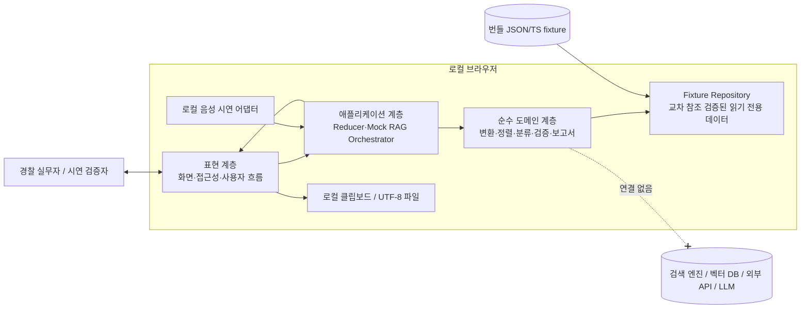
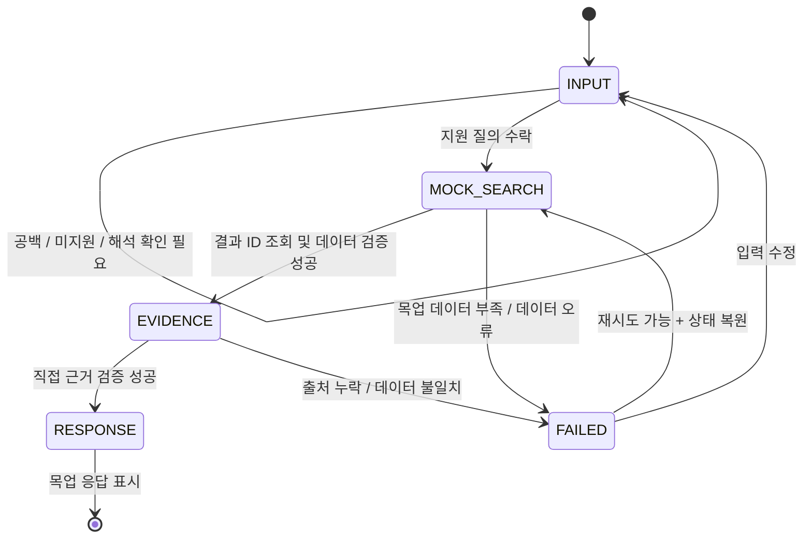
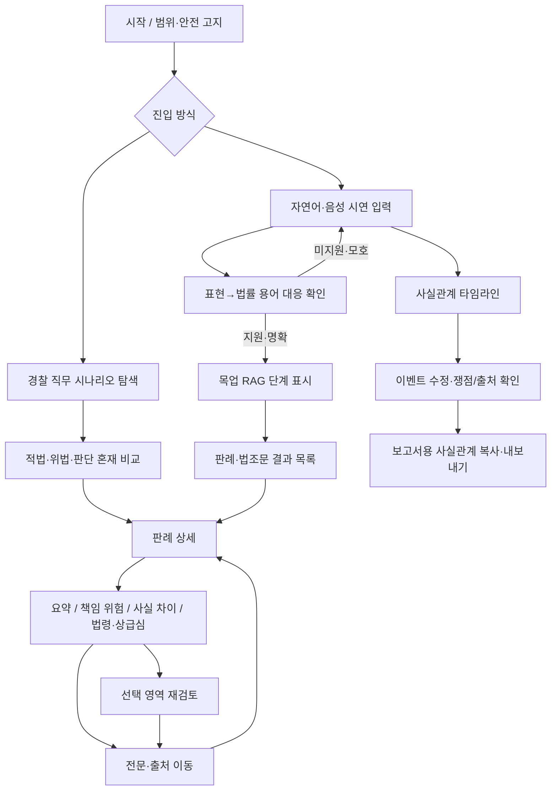

# 설계 문서

## Overview

### 1. 목적

경찰 판례·법령 AI 봇은 경찰 실무자가 사건번호나 죄명을 알지 못해도 현장 표현으로 상황을 입력하고, 사전에 정의된 목업 판례·법령을 탐색하며, 근거와 함께 결과를 이해하고 보고서 사실관계에 재사용하는 **로컬 시연용 애플리케이션**이다.

이 설계에서 RAG는 운영형 검색·생성 시스템이 아니다. 구현 범위는 번들된 정적 fixture와 결정적 규칙을 사용해 다음 순서를 모사하는 완전한 목업이다.

1. 입력: 지원 질의 또는 사전 정의 음성 시연 입력을 식별한다.
2. 목업 검색: 질의 fixture에 연결된 판례·법조문 식별자를 조회한다.
3. 근거 제시: 응답 문장, 요약, 위험 상태, 배지에 연결된 출처를 검증하고 표시한다.
4. 응답: fixture에 저장된 문구와 결정적 표시 규칙만 조합한다.

현재 구현에는 임베딩, 벡터 데이터베이스, 외부 판례·법령 API, 외부 데이터 수집, 실제 LLM, 실시간 동기화, 운영 배포, 법률 판단이 포함되지 않는다. 화면에 보이는 법률 관련 값과 고정 경고·결측 문구는 모두 식별 가능한 목업 데이터 레코드 또는 표시 정책 레코드에서만 읽는다. 결정 규칙은 어떤 레코드 ID를 선택할지만 정하며 새로운 문구나 법률 결론을 생성하지 않는다.

### 2. 설계 목표

- 동일한 데이터셋과 동일한 입력은 단계 순서, 결과, 출처, 응답, 경고까지 항상 같은 결과를 낸다.
- 화면 값에서 fixture 레코드와 근거 구절까지 역추적할 수 있다.
- 데이터 누락·충돌·잘못된 참조가 있을 때 새로운 법률 결론을 만들어 내지 않고 안전하게 실패한다.
- 자연어 입력, 직무 시나리오 비교, 판례 목록·상세, 단계별 요약, 책임 위험, 유사도·사실 차이, 선택 재검토, 법령 상태, 타임라인·보고서 재사용을 명확한 컴포넌트 경계로 분리한다.
- 키보드·스크린 리더·확대 사용과 작은 화면을 고려한다.
- 외부 네트워크 없이 로컬 정적 자산만으로 전체 시연 흐름을 완료한다.

### 3. 비목표와 향후 확장 경계

다음은 현재 구현 범위가 아니며 `ExternalSearchPort`, `GenerationPort`, `LawSyncPort` 같은 **인터페이스 이름조차 현재 런타임에 연결하지 않는다**. 향후 별도 운영 요구사항, 보안·개인정보·법률 검토, 평가 데이터와 승인이 생긴 뒤 독립 어댑터로만 추가한다.

- 의미 기반 임베딩 검색과 벡터 인덱스
- 외부 판례·법령 API 및 크롤러
- 음성 인식 서비스와 실제 생성형 모델
- 최신 법령 동기화와 최신성 보증
- 사용자·사건 데이터의 서버 저장, 인증, 감사 로그
- 법률 판단 또는 수사 의사결정 자동화

향후 확장 시에도 현재의 도메인 모델과 출처 계약을 우회할 수 없게 하고, 외부 결과는 별도 신뢰 경계에서 검증한 뒤 `ValidatedDataset` 형태로 변환해야 한다. 이 항목은 확장 지점일 뿐 현재 구현 계획이 아니다.

### 4. 명시적 가정과 모호성 해소

요구사항을 변경하지 않으며, 구현 결정을 위해 다음을 설계 가정으로 둔다.

1. **기술 스택 부재**: 저장소에는 요구사항과 설정 파일만 있으므로 특정 프레임워크가 이미 존재한다고 가정하지 않는다.
2. **지원 질의 판정**: 의미 추론이나 퍼지 검색을 하지 않는다. `QueryFixture.variants`에 등록된 문장과 결정적 정규화 결과 또는 동일 `coreFactSetId`로 명시된 변형만 지원 질의이다.
3. **관계 보존**: 사람·행위·시점·부정 관계는 NLP가 아니라 fixture의 `RelationGraph` 전후 동일성으로 검증한다. 하나로 결정되지 않으면 입력 단계에서 `해석 확인 필요`가 된다.
4. **음성 입력**: 실제 음성 인식은 범위 밖이다. “음성 입력 시연”은 로컬 `VoiceFixture`를 선택하거나 재생하는 동작을 사전 정의 인식 텍스트로 변환한다. 마이크 원본을 외부로 보내거나 실제 음성을 해석하지 않는다.
5. **요약 줄 수**: 3줄·10줄은 화면 줄바꿈 수가 아니라 데이터의 `SummaryLine` 항목 수이다. 반응형 화면에서 시각적으로 감싸져도 의미상 줄 수는 변하지 않는다.
6. **검색 순서와 법령 상태**: 전역 `searchPriority`가 현행법 기준 우선 규칙까지 반영한 사전 정의 순서다. 데이터 검증기는 현행법 기준 판례가 구법 기준 판례보다 뒤에 오는 fixture를 거부한다. 같은 법령 상태에서는 `searchPriority`, `tieOrder`, `caseId` 순으로 안정 정렬한다.
7. **보고서 내보내기**: 서버 전송 없이 UTF-8 일반 텍스트 다운로드와 클립보드 복사를 제공한다. 두 형식 모두 데이터 기준일과 법률 안전 고지문을 포함한다.
8. **탐색 상태 유지**: 출처 상세를 열었다가 돌아오는 동작은 단일 브라우저 세션의 메모리 상태에서 보존한다. 새로고침 후 복구나 사용자별 영속 저장은 요구 범위가 아니다.
9. **선택 재검토 단위**: 선택 가능한 목업 응답 DOM에 `claimId`를 부여한다. 선택 범위와 겹치는 독립 주장 식별자를 문서 순서대로 중복 제거하여 검토한다. 자유 생성 텍스트를 분석하지 않는다.
10. **타임라인 수정**: 수정은 타임라인과 보고서 파생 텍스트에 즉시 반영하지만 검색 결과를 암묵적으로 다시 계산하지 않는다. 사용자가 수정 내용을 새 질의로 명시적으로 제출할 때만 새 목업 RAG 흐름을 시작한다.
11. **목표 범위 표현**: `공개적으로 확인 가능한 제1심·항소심·상고심 판례`는 목표 데이터 범위 표지이고, 실제 화면 데이터는 `사전에 정의된 목업 전체 심급 판례 샘플`로 별도 표시한다.
12. **가상·샘플 법률 자료**: fixture는 시연 데이터이며 실제 사건 또는 현행 법률의 정확성을 보증하지 않는다. 실제 자료처럼 보이는 경우에도 고지 정책은 예외 없이 적용한다.

### 5. 검토 범위, 참고 후보와 설계 권장사항

이번 최종 검토에서는 외부 웹 문서의 최신 내용·버전·세부 옵션을 별도로 조회해 검증하지 않았다. 따라서 아래 링크와 도구 설명은 **검증된 외부 조사 결과나 확정 구현 근거가 아니라 구현 시 확인할 참고 후보**다. 일반적인 접근성·테스트 원칙은 이 제품에 적용할 설계 권장사항으로만 기술하며, 구현 착수 시 링크의 최신성, 라이선스, 선택한 기술과의 호환성을 다시 확인한다.

- **현재 프로젝트 상태에 대한 확인 범위**: 현재 제공된 작업공간에는 요구사항·설계 등 spec 문서만 있고 구현 코드, 패키지 매니페스트, 빌드 설정은 확인되지 않았다. 따라서 기존 프레임워크나 테스트 도구가 있다고 전제하지 않는다.
- **Reflow 설계 권장사항**: 확대·좁은 화면에서도 의미 순서를 보존하고 본문 양방향 스크롤을 최소화한다. 비교 화면은 데스크톱 3열에서 좁은 화면의 1열 탭/아코디언으로 재배치하는 안을 권장한다. 구현 시 참고 후보: [W3C Reflow 이해 문서](https://www.w3.org/WAI/WCAG22/Understanding/reflow.html).
- **상태 메시지 설계 권장사항**: 목업 RAG 단계, 검색 건수, 복사 완료처럼 초점 이동이 불필요한 상태는 상태 메시지로, 즉시 조치가 필요한 오류는 경고로 전달하는 안을 권장한다. 구체적인 ARIA 사용은 구현 시 선택한 UI 구조와 [W3C Status Messages 이해 문서](https://w3.org/WAI/WCAG21/Understanding/status-messages)를 대조해 확정한다.
- **초점 순서 설계 권장사항**: DOM의 의미 순서와 키보드 조작 순서를 일치시키고, 출처 이동·다이얼로그·선택 재검토 뒤 원래 트리거로 복귀하는 규칙을 상태 모델에 포함하는 안을 권장한다. 구현 시 참고 후보: [W3C Focus Order 이해 문서](https://www.w3.org/TR/UNDERSTANDING-WCAG20/navigation-mechanisms-focus-order.html).
- **속성 테스트 설계 권장사항**: TypeScript 권장 후보를 채택한다면 [fast-check 설정 문서](https://fast-check.dev/docs/configuration/)와 [속성 개요](https://fast-check.dev/docs/core-blocks/properties/)를 구현 시 다시 확인하고, 지원되는 공식 옵션을 사용해 각 속성을 최소 100회 실행하며 재현 정보와 축소된 반례를 보존하는 안을 권장한다. 최소 100회와 반례 보존은 이 설계의 테스트 계약이며 특정 라이브러리가 이미 설치되었다는 뜻이 아니다.

링크 대상의 내용을 이 문서에서 검증된 사실로 단정하거나 인용하지 않는다. 링크는 구현 시 재검증할 참고 후보이고, 위 항목의 구체적 적용 방식은 이 기능의 설계 결정이다.

### 6. 조건부 권장 구현 선택과 대안

현재 프로젝트에 확정된 언어, UI 프레임워크, 빌드 도구, 테스트 라이브러리는 없다. 아래 표는 구현 착수 시 평가할 **조건부 권장 후보**이며 기존 의존성이나 승인된 스택을 뜻하지 않는다. 이 문서의 TypeScript 시그니처와 테스트 코드는 계약을 구체화하기 위한 의사코드다.

| 관심사 | 조건부 권장 후보 | 대안 | 선택 이유 |
|---|---|---|---|
| 언어 | TypeScript strict mode | JavaScript + JSDoc, Kotlin/JS | 식별자·상태 합집합·fixture 계약의 정적 검증 |
| UI | React + Vite 정적 SPA | SvelteKit 정적 어댑터, Vue + Vite, Vanilla TS | 복잡한 상태 패널과 테스트 생태계; 서버 불필요 |
| 상태 | 순수 reducer + selector | XState, Zustand의 순수 store | 단계 전이와 오류 전 상태를 명시적으로 검증 |
| fixture 검증 | JSON Schema + Ajv 또는 TypeScript 스키마 라이브러리 | 빌드 시 사용자 정의 validator | 교차 참조 검증 전 구조 검증 |
| 예제 테스트 | Vitest + DOM Testing Library | Jest, Web Test Runner | 정적 프런트엔드와 빠른 단일 실행 |
| 속성 테스트 | fast-check | jsverify | 생성기·재현 정보·축소·상태 모델 요구 충족 여부를 구현 시 확인 |
| 접근성 점검 | axe-core 기반 자동 점검 + 수동 키보드/스크린 리더 점검 | pa11y | 자동 규칙만으로 확인 못 하는 초점·읽기 순서를 수동 보완 |
| 로컬 제공 | 빌드된 정적 자산을 로컬 정적 서버로 제공 | 데스크톱 래퍼 | 네트워크 의존 없이 재현 가능; `file://` 모듈 제약 회피 |

구현의 첫 기술 결정 단계에서 로컬 실행 제약, 팀 역량, 테스트 가능성을 기준으로 언어·UI·빌드·테스트 도구를 확정한다. React, Vite, Vitest, fast-check, Ajv, axe-core는 그때 채택 여부를 판단할 후보일 뿐이며, 다른 선택을 하더라도 아래 도메인 계약·목업 전용 경계·추적성 요구는 유지한다. 채택한 모든 의존성은 정확한 버전으로 고정하고 실제 사용 가능 옵션과 라이선스를 해당 시점의 공식 자료로 확인한다. 목업 동작을 위해 서버 프레임워크, 데이터베이스, 검색 SDK, 벡터 저장소 SDK, 외부 API 클라이언트 또는 외부 AI/LLM 라이브러리를 추가하지 않는다.

## Architecture

### 1. 시스템 컨텍스트



런타임 의존 방향은 `UI → Application → Domain ← Repository contract`로 제한하고, 번들된 로컬 fixture 어댑터만 도메인 저장소 계약을 구현한다. `FixtureRepository` 이외의 검색·데이터 공급자는 현재 런타임에 존재하지 않는다. `fetch`, `XMLHttpRequest`, `WebSocket`, `EventSource`, `sendBeacon`을 사용하는 애플리케이션 코드는 두지 않는다. 브라우저가 로컬 정적 자산을 최초 로드하는 동작 외에 질의 처리 중 네트워크·서비스 실행 호출은 0건이며, localhost API나 별도 로컬 검색 서비스도 사용하지 않는다. 질의 처리는 메모리에 로드된 fixture 조회와 순수 함수 호출로 완료하고, 클립보드와 파일 다운로드만 명시된 로컬 I/O 경계에서 수행한다.

아키텍처에서 `목업 RAG`라는 이름은 사용자에게 보여 주는 단계형 시연 흐름을 뜻할 뿐 실제 검색 또는 생성을 뜻하지 않는다. 각 단계의 구현 의미를 다음으로 고정한다.

| 목업 단계 | 현재 범위의 유일한 처리 | 포함하지 않는 처리 |
|---|---|---|
| 입력 | 정규화된 문자열을 로컬 `QueryFixture` 키와 정확히 대조 | NLP 서비스, 임베딩 생성, 원격 질의 해석 |
| 목업 검색 | fixture에 사전 연결된 case/statute ID를 `FixtureRepository`에서 조회 | 전문 검색 엔진, 벡터 유사도 검색, 외부 API·DB 조회, 런타임 순위 산식 |
| 근거 제시 | 로컬 source/anchor 교차 참조와 사전 선언된 관계를 검증 | 웹 검색, 원격 원문 조회, 모델 기반 사실 검증 |
| 응답 | `ResponseTemplate`의 사전 정의 블록을 결정적으로 projection | 프롬프트 실행, 토큰 생성, 실제 LLM 또는 생성형 모델 호출 |

따라서 검색 엔진·벡터 DB·외부 판례/법령 API·실제 LLM은 단순히 오프라인일 때 대체되는 의존성이 아니라 현재 시스템 경계 밖의 미구현 대상이다. 오류가 나도 이 경계를 넘어 fallback하지 않는다.

### 2. 계층과 책임

| 계층 | 책임 | 금지 사항 |
|---|---|---|
| 표현 계층 | 입력, 시나리오 탐색, 결과 목록/상세, 접근성, 반응형 배치, 초점·강조 | 법률 상태 계산, fixture 직접 조회 |
| 애플리케이션 계층 | 명령 처리, RAG 상태 전이, 화면 상태 보존, 오류 전 스냅샷, 컴포넌트 조정 | 임의 문구 생성, 외부 I/O |
| 도메인 계층 | 질의 해석, 안정 정렬, 상태 분류, 출처 판정, 타임라인 정렬, 보고서 생성 | DOM 조작, 네트워크, 현재 시각 의존 |
| 데이터 계층 | 구조·교차 참조·불변식 검증, ID 조회, 읽기 전용 projection | 검색 산식 추론, 레코드 자동 보정 |
| 로컬 I/O 경계 | 클립보드 복사, UTF-8 다운로드, 로컬 음성 시연 선택 | 서버 업로드, 원격 분석, 자동 저장 |

모든 도메인 함수에는 `Date.now()`, 난수, 로케일 의존 정렬을 넣지 않는다. 날짜 비교 기준은 오직 `dataset.asOfDate`, 동순위 최종 키는 정규화된 `caseId`다.

### 3. 목업 RAG 파이프라인과 상태 모델



각 단계는 `pending | active | completed | failed | incomplete` 중 하나다. 한 시점에 `active`는 정확히 하나이며, 완료된 단계의 바로 다음 단계만 활성화할 수 있다. 오류 시 `ErrorSnapshot`에 상황 질의, 선택 판례, 요약 단계, 필터, 선택 문구를 보존한다. 재시도는 오류가 난 단계부터 같은 데이터셋으로 반복하고, 미완료 단계는 `incomplete`로 유지한다.

#### 전이 규칙

| 이벤트 | 사전 조건 | 다음 상태 | 효과 |
|---|---|---|---|
| `SUBMIT_QUERY` | dataset valid, nonblank | `INPUT` 또는 `MOCK_SEARCH` | 지원·관계 보존 판정; 결과를 아직 표시하지 않음 |
| `ADVANCE_SEARCH` | `INPUT=completed` | `MOCK_SEARCH` | fixture의 match ID를 조회하고 유효하지 않은 판례를 제외 |
| `ADVANCE_EVIDENCE` | `MOCK_SEARCH=completed` | `EVIDENCE` | 인용과 출처 앵커를 검증; 잘못된 인용은 숨김 |
| `ADVANCE_RESPONSE` | `EVIDENCE=completed` | `RESPONSE` | 사전 정의 응답 조각만 조합 |
| `FAIL_STAGE` | active stage 존재 | `FAILED` | 단계·재시도 가능 여부·오류 전 상태 표시 |
| `RETRY_STAGE` | retryable error | 실패 단계 | 동일 입력과 snapshot 복원 |
| `RESET_INPUT` | any | `INPUT` | 새 질의 흐름; 이전 법률 결론을 재사용하지 않음 |

### 4. 결정적 처리 규칙

#### 4.1 질의 수락과 용어 대응

1. 입력의 앞뒤 공백을 제거한다. 빈 문자열이면 입력 상태와 빈 결과를 유지한다.
2. 비교용 문자열에만 데이터셋이 선언한 `normalizationVersion` 규칙(유니코드 정규화, 연속 공백 축약, 허용 문장부호 처리)을 적용한다. 화면에는 원문을 보존한다.
3. 정규화 키를 `QueryVariant` 인덱스에서 정확히 조회한다. 일치가 없으면 미지원 질의와 지원 시나리오 목록을 표시한다.
4. 변형에 연결된 `TermMapping`과 `RelationGraph`를 읽는다. 미대응 표현은 원문과 함께 `해석 확인 필요`로 표시한다.
5. 변환 전후의 actor-action, action-time, negation-target edge 집합이 같지 않거나 복수 해석만 있으면 입력 단계에서 중단한다.
6. 같은 `coreFactSetId`로 등록된 명시 시점 문장 순서 변형은 같은 match set과 similarity table을 가리켜야 하며 부트 검증에서 이를 강제한다.

#### 4.2 목업 검색과 정렬

- 검색은 `queryFixture.match.caseIds`와 `statuteVersionIds`를 ID로 조회하는 작업이다. 전문 검색, 임베딩 또는 점수 계산을 하지 않는다.
- 판례별 유사도는 `SimilarityPreset.score`를 그대로 사용한다. 숫자가 아니거나 `[0, 100]` 밖이면 해당 판례를 제외하고 `유사도 데이터 오류`를 표시한다.
- 판례는 `(searchPriority 오름차순, tieOrder 오름차순, caseId 코드포인트 오름차순)`으로 안정 정렬한다.
- 검증기는 현행법 기준 판례의 우선순위가 구법 기준 판례보다 낮은 순위가 되지 않도록 확인한다. 같은 우선순위는 `tieOrder`가 유일해야 한다.
- 시나리오와 보조 필터는 논리곱으로 적용한다. 동일 판례 ID는 어느 결과/구분 영역에도 한 번만 렌더링한다.

#### 4.3 응답과 출처

- `ResponseTemplate`의 블록을 순서대로 선택하되 각 법률 주장 블록은 `claimId`와 직접 출처를 가진다.
- 출처 ID가 없거나 source/anchor가 유효하지 않으면 인용을 숨기고 `출처 데이터 오류`를 노출한다.
- 직접 출처가 주장을 완전히 지지하지 않는 것으로 fixture에 선언되면 `근거_부족`으로 표시한다. 관련성만 있는 출처는 참고 출처로만 제공한다.
- source ID는 데이터셋 전체에서 유일하고 정확히 한 `SourceRecord`를 가리킨다. 앵커는 source 본문 범위 안이어야 한다.

#### 4.4 법령 상태

```text
classifyLawStatus(appliedVersions, currentVersionsAtAsOf):
  if appliedVersions is empty:
    return INDETERMINATE
  if any required amendment/effective/applied version is missing or incomparable:
    return INDETERMINATE
  if every applied version id equals its statute's current version id:
    return CURRENT
  return OLD
```

fixture에 저장된 기대 상태와 계산 상태가 다르면 판례 데이터 불일치로 취급한다. 구법 판례에는 관련 개정 설명 fixture를 표시하며, 판별 불가를 현행 또는 구법으로 추정하지 않는다.

#### 4.5 책임 위험과 행동 배지

- 위험 축별 판단 출처가 0개면 `정보_없음`이다.
- 유효 출처가 한 상태로 만장일치하면 그 상태다.
- 서로 충돌하거나 단일 상태로 매핑할 수 없으면 `분류_불가`다.
- 행동 판단 출처가 모두 문제 판단이면 `문제_행동`, 모두 적법 판단이면 `적법_행동`, 없으면 `정보_없음`, 충돌하면 `분류_불가`다.
- 하나의 행동에는 최대 하나의 배지만 파생한다. 색상 외에도 문구와 아이콘을 함께 사용한다.

#### 4.6 유사도 경고와 사실 차이

- `[80,100]`: `높은 유사도 — 핵심 차이 확인 필요`
- `[50,80)`: `중간 유사도 — 직접 적용 전 사실관계 재검토 필요`
- `[0,50)`: `낮은 유사도 — 결론 근거로 사용 금지`
- 높은 유사도이고 `couldChangeConclusion=true`인 사실 차이가 있으면 점수보다 먼저 경고 영역에 배치한다.
- 사용자 사실, 판례 사실, 결론 영향 중 fixture 값이 없는 필드는 각각 `확인 필요`로 표시한다. 유사도는 적법성, 결론, 죄명, 재판 결과를 바꾸지 않는다.

#### 4.7 선택 영역 재검토

```text
classifyClaim(evidence):
  if any decision evidence has relation=CONTRADICTS: return CONFLICT
  if one or more decision evidence collectively cover the whole claim
     and none contradicts: return MATCH
  return INSUFFICIENT
```

선택 범위와 겹치는 `claimId`를 문서 순서대로 중복 제거한다. 공백만 선택하면 선택 대기 상태를 유지한다. 결정 근거와 참고 출처는 별도 컬렉션으로 렌더링한다. 상세 설명은 `SelectionExplanationFixture`의 법률 용어·문맥·쟁점 필드만 표시하며 없는 경우 필요한 추가 정보와 함께 확인 불가를 알린다.

#### 4.8 타임라인과 보고서

1. 명시 시각 이벤트를 ISO 시각 오름차순으로 정렬한다.
2. 기준 이벤트가 유효한 상대 시각은 fixture의 해석된 정렬 키를 사용한다.
3. 같은 시각은 `originalOrder`를 유지한다.
4. 시점 미상 이벤트는 원문과 함께 별도 영역에서 원래 순서로 둔다.
5. 복수 시간/주체 해석은 후보를 보존하고 `사용자 확인 필요`로 둔다.
6. 이벤트 수정은 불변 업데이트로 timeline과 report selector에 동시에 반영한다.
7. 보고서는 화면 타임라인 순서의 event ID를 정확히 한 번씩 사용하고 마지막에 데이터 기준일과 안전 고지문을 붙인다.

### 5. 화면 및 사용자 흐름



#### 5.1 공통 셸

- 상단에 `목업`, 데이터 기준일, 실시간 동기화 없음, 목표/현재 데이터 범위를 고정 정보 영역으로 제공한다.
- 법률 안전 고지는 결과와 인접한 가시 영역에 두며 단순 툴팁으로 숨기지 않는다.
- 전역 내비게이션은 `상황 검색`, `직무 시나리오`, `타임라인`으로 구성한다.
- RAG 단계와 오류는 시각적 stepper와 보조기술용 상태 메시지를 함께 제공한다.

#### 5.2 상황 입력 화면

- 텍스트 입력과 로컬 음성 시연 선택을 제공한다.
- 변환 후에는 `원래 표현 ↔ 법률 검색어` 대응표와 관계 보존 상태를 보여 준다.
- 미대응·복수 해석 표현은 원문, 가능한 해석, `해석 확인 필요`를 표시하고 검색 버튼을 비활성화한다.
- 미지원 질의에는 지원되는 8개 직무 시나리오 바로가기를 제공한다.

#### 5.3 직무 시나리오 탐색 화면

- 현행범체포, 임의동행, 긴급체포, 압수수색, 미란다 원칙 고지, 진술거부권, 가정폭력 초동조치, 음주단속을 기본 탐색 항목으로 제공한다.
- 형사·민사·행정은 데이터가 있을 때만 보조 필터로 제공한다.
- 데스크톱은 적법/위법/판단 혼재 3열 비교, 좁은 화면은 동일 의미 순서의 탭과 각 탭의 건수로 제공한다.
- 판단 혼재 카드에는 행동별 법원 판단을 분리한다.

#### 5.4 결과 목록과 상세

- 목록 카드는 사건번호, 법원명, 심급, 선고일, 시나리오, 유사도, 적법성, 법령 상태, 죄명, 실제 결과를 표시한다.
- 법조문 목록은 법령명, 조·항·호, 시행일을 표시한다.
- 사실 차이 경고는 높은 유사도 점수보다 앞에 올 수 있다.
- 상세 화면은 `요약`, `개인 책임 위험`, `핵심 사실 차이`, `법령 상태`, `상급심`, `전문` 섹션으로 구분한다.
- 전문은 최초 접힘 상태이며 요약 단계와 독립적으로 토글한다. 출처를 선택하면 전문을 열고 앵커로 이동해 강조한 뒤 원래 인용으로 돌아갈 수 있는 링크를 제공한다.

#### 5.5 단계별 요약

- 3줄: 사건 개요 → 법원 결론 → 현장 경찰 핵심 포인트의 정확히 3개 의미 줄.
- 10줄: 필수 8개 항목을 포함하는 정확히 10개 의미 줄. 중복되는 추가 두 줄의 항목명도 fixture에 명시한다.
- 상세: 같은 필수 항목을 섹션으로 제공하며 줄 수 제한은 없다.
- 단계 변경 시 결론, 적법성, 죄명, 결과는 동일한 canonical case projection에서 읽어 일관성을 보장한다.
- 법률 용어의 최초 현장 표현 설명에는 원래 법률 용어를 함께 표시한다.

#### 5.6 선택 영역 재검토

- 마우스 드래그, 키보드 텍스트 선택, 문맥 메뉴 모두 같은 작업 패널을 연다.
- `사실 확인 재검토`와 `상세 설명`을 제공한다.
- 독립 주장별 상태와 결정 근거를 표시하고 참고 출처는 별도 영역에 둔다.
- 출처 이동 후 뒤로 가면 선택 문구와 결과를 보존하고 선택 재검토 트리거로 초점을 돌린다.

#### 5.7 타임라인과 보고서

- 사전 정의 인식 텍스트, 정렬된 이벤트, 시점 미상, 사용자 확인 필요를 분리한다.
- 이벤트 편집 폼은 시간·주체·행위 원문을 보존하고 수정 전/후를 시각적으로 구분한다.
- 각 이벤트에 쟁점 또는 연결 쟁점 없음을 표시하며, 연결된 출처로 이동할 수 있다.
- 보고서 미리보기, 복사, `.txt` 내보내기를 제공하고 성공/실패 상태를 알린다.

### 6. 접근성 및 반응형 원칙

- 모든 동작은 키보드로 수행 가능하며 시각적 DOM 순서와 초점 순서를 일치시킨다.
- 출처 이동 시 대상 구절 컨테이너에 프로그램적으로 초점을 주고, 복귀 시 원래 출처 링크로 되돌린다.
- 모달/팝오버는 제목, 닫기, 초점 진입·복귀를 갖는다. Escape로 닫을 수 있다.
- RAG 진행, 검색 결과 건수, 복사 완료는 `role="status"`; 즉시 조치가 필요한 데이터 오류는 `role="alert"`를 사용한다.
- 문제/적법, 법령 상태, 위험 상태는 색상만으로 구분하지 않고 텍스트·아이콘·형태를 함께 사용한다.
- 표는 작은 화면에서 의미 있는 카드/정의 목록으로 바뀌며, 320 CSS px 수준에서 본문 양방향 스크롤을 요구하지 않는다. 전문 코드·긴 사건번호처럼 본질적으로 긴 토큰만 내부 스크롤/줄바꿈 정책을 적용한다.
- 확대 200%, 고대비/강제 색상, `prefers-reduced-motion`을 고려한다.
- 요약 탭, 시나리오 탭, 아코디언에 올바른 이름·상태(`aria-selected`, `aria-expanded`, 관계 ID)를 제공한다.
- 드래그만으로 재검토를 강제하지 않고 키보드용 “현재 문장 재검토” 동작을 제공한다.
- 자동화 접근성 검사와 별도로 키보드 순서, 스크린 리더 상태 알림, 출처 초점 왕복을 수동 검증한다.

### 7. 로컬 실행과 네트워크 차단

- fixture, 글꼴, 아이콘, 스키마를 빌드 산출물에 포함하고 CDN을 사용하지 않는다.
- 개발/시연 시 로컬 정적 서버로 제공하며 인터넷 연결 없이 동작해야 한다.
- 가능한 호스트 환경에서는 CSP `default-src 'self'; connect-src 'none'`를 적용한다. 개발 도구의 라이브 리로드는 시연/검증 빌드에서 제거한다.
- 서비스 워커나 원격 분석 코드를 두지 않는다. 브라우저 네트워크 계측 테스트로 질의 제출부터 완료/실패까지 외부 실행 호출 0건을 확인한다.
- 클립보드 권한 거부 시 선택 가능한 텍스트와 수동 복사 안내를 제공한다. 파일 다운로드는 메모리 Blob처럼 브라우저 로컬 기능만 사용한다.

## Components and Interfaces

### 1. 컴포넌트 경계

| 컴포넌트 | 입력 | 출력/책임 | 관련 요구사항 |
|---|---|---|---|
| `AppShell` | dataset metadata, route | 공통 목업 표지, 기준일, 안전 고지, 범위 표지 | 1, 12 |
| `SituationInput` | draft, voice fixtures | 원문, 제출 명령, 공백/음성 실패 안내 | 2, 11 |
| `QueryInterpreter` | raw query, query fixtures | 지원 여부, 용어 대응, relation 보존/모호성 | 2, 8 |
| `MockRagOrchestrator` | accepted query, dataset | 순차 단계와 오류 snapshot | 1, 13 |
| `ScenarioExplorer` | scenario, auxiliary filter | 8개 시나리오 및 교집합 비교 | 4 |
| `MockSearchService` | query fixture | 판례/법조문 projection, 안정 순서, 데이터 오류 | 3, 7, 10 |
| `ResultList` | result projection | 판례·법조문 카드와 빈 상태 | 3, 7, 12 |
| `CaseDetail` | selected case | 상세 섹션 조정, 상태 유지 | 3, 5–8, 10, 12, 13 |
| `TieredSummary` | summary level, case | 3/10/상세 요약과 직접 출처 | 5 |
| `LiabilityAndActionPanel` | risk evidence, action evidence | 위험 3축 및 단일 행동 배지 | 6 |
| `SimilarityAndDifferencePanel` | preset score, differences | 경고와 사용자/판례/영향 비교 | 7, 8 |
| `SourceViewer` | source/anchor ID | 접이식 전문, 이동·강조·복귀 | 3, 5, 9, 13 |
| `SelectionReview` | selected claim IDs | 주장별 사실 확인, 상세 설명, 근거/참고 분리 | 9 |
| `LawStatusPanel` | applied/current versions | 현행/구법/판별 불가, 날짜·개정 설명 | 10 |
| `AppealStatusPanel` | appellate/finality data | 원심 대비 상급심, 확정 상태 | 12 |
| `TimelineEditor` | recognized events | 결정적 정렬, 모호성, 수정, 쟁점·출처 | 11 |
| `ReportReuse` | current timeline | 복사/내보내기 가능한 사실관계와 고지 | 1, 11 |
| `DatasetValidator` | untrusted fixture | 구조/참조/불변식이 확인된 dataset 또는 diagnostics | 전 요구사항, 13 |
| `LegalNoticePolicy` | surface, content kind | 고지문·목업 표지·기준일의 필수 배치 | 1, 7, 10, 11, 12 |

컴포넌트는 레코드를 직접 수정하지 않는다. 모든 변경은 명령 → reducer → selector 흐름을 따르며, 화면용 값은 검증된 데이터 또는 순수 파생값이다.

### 2. 핵심 포트와 함수 시그니처

다음은 TypeScript 조건부 권장 후보를 채택할 경우의 계약 의사코드이며, 특정 언어·프레임워크 API 또는 이미 존재하는 프로젝트 구현을 뜻하지 않는다.

```ts
type Result<T, E> =
  | { ok: true; value: T }
  | { ok: false; error: E };

type DatasetId = string & { readonly __brand: "DatasetId" };
type QueryId = string & { readonly __brand: "QueryId" };
type CaseId = string & { readonly __brand: "CaseId" };
type StatuteVersionId = string & { readonly __brand: "StatuteVersionId" };
type SourceId = string & { readonly __brand: "SourceId" };
type ClaimId = string & { readonly __brand: "ClaimId" };
type EventId = string & { readonly __brand: "EventId" };

interface FixtureRepository {
  metadata(): DatasetMetadata;
  supportedScenarios(): readonly PoliceScenario[];
  findQueryByNormalizedVariant(key: string): QueryFixture | undefined;
  getCase(id: CaseId): CaseRecord | undefined;
  getStatuteVersion(id: StatuteVersionId): StatuteVersion | undefined;
  getSource(id: SourceId): SourceRecord | undefined;
}

interface LocalVoiceDemoPort {
  recognize(fixtureId: VoiceFixtureId): Result<RecognizedVoiceText, VoiceDemoError>;
}

interface LocalExportPort {
  copyText(text: string): Promise<Result<void, LocalExportError>>;
  downloadUtf8(filename: string, text: string): Result<void, LocalExportError>;
}
```

현재 범위에서 허용할 런타임 포트는 읽기 전용 `FixtureRepository`, 사전 정의 음성 텍스트를 반환하는 `LocalVoiceDemoPort`, 브라우저 로컬 복사·다운로드를 감싸는 `LocalExportPort`뿐이다. 검색 엔진, 임베딩, 벡터 저장소, 외부 판례·법령 API, 원격 음성 인식, 생성형 모델·LLM을 위한 포트·클라이언트·어댑터는 향후 구현 코드에 정의하거나 주입하지 않는다. 이들은 테스트에서 가짜 구현으로 대체할 숨은 의존성도 아니다. `runMockSearch`는 fixture ID 조회, `citationsForClaim`은 로컬 교차 참조 검증, 응답 조립은 사전 정의 template projection으로만 구현한다.

```ts
function normalizeForFixtureMatch(
  raw: string,
  rules: NormalizationRules
): NormalizedQuery;

function interpretQuery(
  raw: string,
  dataset: ValidatedDataset
): QueryInterpretation;

function relationsPreserved(
  before: RelationGraph,
  after: RelationGraph
): boolean;

function runMockSearch(
  query: AcceptedQuery,
  repo: FixtureRepository
): Result<SearchProjection, MockRagError>;

function sortCasesDeterministically(
  cases: readonly SearchCaseProjection[]
): readonly SearchCaseProjection[];

function filterScenarioIntersection(
  cases: readonly CaseRecord[],
  scenario: PoliceScenario,
  auxiliary?: TraditionalCaseArea
): readonly CaseRecord[];

function classifyLawStatus(
  applied: readonly AppliedStatuteRef[],
  statutes: ReadonlyMap<StatuteVersionId, StatuteVersion>,
  asOfDate: IsoDate
): LawBasisStatus;

function classifyEvidence<TStatus extends string>(
  evidence: readonly ClassifiedEvidence<TStatus>[]
): TStatus | "NO_INFORMATION" | "UNCLASSIFIABLE";

function classifyClaimEvidence(
  evidence: readonly ClaimEvidenceLink[]
): EvidenceStatus;

function similarityWarning(
  score: number,
  policies: readonly SimilarityWarningPolicyRecord[]
): SimilarityWarningPolicyRecord;

function orderFactDifferences(
  score: number,
  differences: readonly FactDifference[]
): readonly FactDifference[];

function buildTimeline(
  events: readonly RecognizedEvent[]
): TimelineProjection;

function updateTimelineEvent(
  state: TimelineState,
  command: UpdateEventCommand
): TimelineState;

function buildReportFacts(
  timeline: TimelineProjection,
  meta: DatasetMetadata,
  notice: LegalNotice
): ReportDocument;

function citationsForClaim(
  claimId: ClaimId,
  dataset: ValidatedDataset
): Result<readonly CitationProjection[], CitationError>;
```

### 3. 애플리케이션 명령과 reducer

```ts
type AppCommand =
  | { type: "SUBMIT_QUERY"; raw: string }
  | { type: "SELECT_VOICE_FIXTURE"; fixtureId: VoiceFixtureId }
  | { type: "ADVANCE_RAG" }
  | { type: "RETRY_RAG" }
  | { type: "SELECT_SCENARIO"; scenario: PoliceScenario }
  | { type: "SET_AUXILIARY_FILTER"; area?: TraditionalCaseArea }
  | { type: "SELECT_CASE"; caseId: CaseId }
  | { type: "SET_SUMMARY_LEVEL"; level: SummaryLevel }
  | { type: "TOGGLE_SOURCE"; sourceId: SourceId }
  | { type: "SELECT_CLAIMS"; claimIds: readonly ClaimId[]; text: string }
  | { type: "RUN_FACT_CHECK" }
  | { type: "RUN_EXPLANATION" }
  | { type: "UPDATE_TIMELINE_EVENT"; update: UpdateEventCommand }
  | { type: "GENERATE_REPORT" }
  | { type: "RETURN_FROM_SOURCE" };

function appReducer(
  state: Readonly<AppState>,
  command: Readonly<AppCommand>,
  deps: Readonly<DomainDependencies>
): Readonly<AppState>;
```

`appReducer`는 직접 복사·다운로드를 수행하지 않는다. 효과 명령을 반환하고 UI 경계가 `LocalExportPort`를 호출한 뒤 성공/실패 이벤트를 dispatch한다. 오류 전 상태는 깊은 복사가 아니라 불변 상태 참조로 보존한다.

### 4. 출처 탐색 계약

```ts
interface CitationProjection {
  claimId: ClaimId;
  sourceId: SourceId;
  anchorId: SourceAnchorId;
  purpose: "DIRECT" | "REFERENCE";
  label: string;
}

interface SourceNavigationRequest {
  fromElementId: string;
  sourceId: SourceId;
  anchorId: SourceAnchorId;
}

interface SourceNavigationResult {
  expanded: true;
  targetElementId: string;
  highlightRange: TextRange;
  returnFocusElementId: string;
}
```

한 인용 문장의 직접 출처는 `(sourceId, anchorId)`로 중복 제거한다. 같은 source의 서로 다른 직접 구절은 서로 다른 anchor로 유지한다. 앵커 이동은 URL 조각만 믿지 않고 검증된 source/anchor 인덱스를 사용한다.

### 5. 법률 고지 노출 정책

```ts
type NoticeSurface =
  | "APP_SHELL"
  | "SEARCH_RESULTS"
  | "MOCK_RESPONSE"
  | "SOURCE_VIEWER"
  | "REPORT_PREVIEW"
  | "CLIPBOARD"
  | "DOWNLOAD";

interface NoticeRequirement {
  showMockBadge: boolean;
  includeSafetyNotice: boolean;
  includeAsOfDate: boolean;
  includeNoRealtimeSync: boolean;
  includeSimilarityDisclaimer: boolean;
  includeInstanceCaution: boolean;
  requiredPolicyRecordIds: readonly string[];
}

function noticeFor(
  surface: NoticeSurface,
  policies: MockDisplayPolicies
): NoticeRequirement;
```

- 모든 검색 결과·응답에는 `목업 응답` 표지가 보인다.
- 응답, 출처, 보고서의 표시·복사·내보내기에는 정확한 법률 안전 고지문이 포함된다.
- 결과에는 데이터 기준일과 실시간 동기화 없음이 포함된다.
- `includeInstanceCaution`은 판례 목록·상세에 `판례는 심급 및 절차 경과에 따라 결론이 달라질 수 있으므로, 상급심 판단과 확정 여부를 함께 확인해야 합니다.`라는 심급·확정 고정 안내가 포함되어야 함을 뜻한다.
- 유사도 표시 화면에는 사전 정의 목업 값 고정 문구가 포함된다.

## Data Models

### 1. 데이터셋 루트와 메타데이터

```ts
interface MockDataset {
  schemaVersion: string;
  datasetId: DatasetId;
  datasetVersion: string;
  normalizationVersion: string;
  asOfDate: IsoDate;
  targetCoverageLabel: "공개적으로 확인 가능한 제1심·항소심·상고심 판례";
  implementedCoverageLabel: "사전에 정의된 목업 전체 심급 판례 샘플";
  legalSafetyNotice: "본 서비스는 수사 및 법률 업무의 정보 정리·검토를 지원하기 위한 목업 데이터 기반 시연용 프로토타입입니다. 제공 결과는 담당자의 검토와 관계 법령 및 내부 절차에 따른 판단을 보조하며, 최종 법률 판단·수사 판단·공식 업무 결정을 대체하지 않습니다.";
  noRealtimeSyncLabel: "실시간 판례·법령 동기화 없음";
  scenarios: readonly ScenarioDefinition[];
  queries: readonly QueryFixture[];
  termMappings: readonly LegalTermMapping[];
  cases: readonly CaseRecord[];
  statutes: readonly StatuteRecord[];
  statuteVersions: readonly StatuteVersion[];
  sources: readonly SourceRecord[];
  responseTemplates: readonly ResponseTemplate[];
  reviewFixtures: readonly SelectionReviewFixture[];
  voiceFixtures: readonly VoiceFixture[];
  displayPolicies: MockDisplayPolicies;
}

interface MockDisplayPolicies {
  notices: readonly DisplayPolicyRecord[];
  placeholders: readonly DisplayPolicyRecord[];
  statusLabels: readonly DisplayPolicyRecord[];
  similarityWarnings: readonly SimilarityWarningPolicyRecord[];
}

interface DisplayPolicyRecord {
  id: string;
  kind: "NOTICE" | "PLACEHOLDER" | "STATUS_LABEL";
  key: string;
  text: string;
}

interface SimilarityWarningPolicyRecord {
  id: string;
  kind: "SIMILARITY_WARNING";
  key: "HIGH" | "MEDIUM" | "LOW";
  minInclusive: number;
  maxInclusive?: number;
  maxExclusive?: number;
  text:
    | "높은 유사도 — 핵심 차이 확인 필요"
    | "중간 유사도 — 직접 적용 전 사실관계 재검토 필요"
    | "낮은 유사도 — 결론 근거로 사용 금지";
}
```

안전 고지, 유사도 경고, `정보_없음`, `분류_불가`, `확인 필요`, `확인되지 않음`, 데이터 오류 같은 고정 표시도 ID가 있는 표시 정책 레코드다. 분류 함수는 문자열을 직접 만들지 않고 정책 key를 선택하며, 화면 projection은 해당 정책 `id`와 `text`를 함께 가진다.

`ValidatedDataset`은 `MockDataset`을 구조 검증하고 모든 교차 참조와 도메인 불변식을 확인한 뒤에만 생성할 수 있는 불투명 타입이다. UI는 원본 JSON에 접근하지 않는다.

### 2. 질의 변형, 법률 용어 매핑, 관계 그래프

```ts
interface QueryFixture {
  id: QueryId;
  scenarioIds: readonly PoliceScenario[];
  coreFactSetId: string;
  variants: readonly QueryVariant[];
  termMappingIds: readonly string[];
  canonicalRelations: RelationGraph;
  match: {
    caseIds: readonly CaseId[];
    statuteVersionIds: readonly StatuteVersionId[];
    responseTemplateId: string;
  };
  recognizedEvents: readonly RecognizedEvent[];
  factValues: Readonly<Record<FactDimension, string | null>>;
  similarityByCase: Readonly<Record<CaseId, SimilarityPreset>>;
}

interface QueryVariant {
  id: string;
  rawExample: string;
  normalizedKey: string;
  inputMode: "TEXT" | "VOICE_FIXTURE";
  relationGraph: RelationGraph;
  explicitTimeCoreFacts: readonly string[];
}

interface LegalTermMapping {
  id: string;
  fieldExpression: string;
  legalSearchTerms: readonly string[];
  relationGraphBefore: RelationGraph;
  relationGraphAfter: RelationGraph | readonly RelationGraph[];
  unsupportedFragments: readonly string[];
}

interface RelationGraph {
  actors: readonly string[];
  actions: readonly string[];
  times: readonly string[];
  negations: readonly string[];
  edges: readonly RelationEdge[];
}

type RelationEdge =
  | { type: "ACTOR_ACTION"; actor: string; action: string }
  | { type: "ACTION_TIME"; action: string; time: string }
  | { type: "NEGATION_TARGET"; negation: string; target: string };
```

배열의 순서는 화면 표시 순서가 필요한 경우에만 의미가 있다. 관계 동등성은 정규화된 edge 집합으로 비교한다.

### 3. 판례와 사전 정의 검색 값

```ts
type PoliceScenario =
  | "현행범체포"
  | "임의동행"
  | "긴급체포"
  | "압수수색"
  | "미란다 원칙 고지"
  | "진술거부권"
  | "가정폭력 초동조치"
  | "음주단속";

type TraditionalCaseArea = "형사" | "민사" | "행정";
type LegalityStatus = "적법" | "위법" | "판단_혼재";
type LawBasisStatus = "현행법_기준" | "구법_기준" | "법령_상태_판별불가";

interface CaseRecord {
  id: CaseId;
  courtName: string;
  instance: "1심" | "항소심" | "상고심";
  caseNumber: string;
  decisionDate: IsoDate;
  scenarioIds: readonly PoliceScenario[];
  traditionalAreas?: readonly TraditionalCaseArea[];
  legalityStatus: LegalityStatus;
  actionJudgments: readonly ActionJudgment[];
  sourceIds: readonly SourceId[];
  appliedStatutes: readonly AppliedStatuteRef[];
  expectedLawBasisStatus: LawBasisStatus;
  summaries: SummaryBundle;
  finalRecognizedCharge: string | null;
  actualOutcome: string | null;
  liability: PersonalLiabilityRisk;
  appellate: AppellateInformation;
  finality: "확정" | "미확정" | "정보_없음";
  factDifferencesByQuery: Readonly<Record<QueryId, readonly FactDifference[]>>;
}

interface SimilarityPreset {
  score: number;
  searchPriority: number;
  tieOrder: number;
  similarityFactors: readonly string[];
  recencyFactors: readonly string[];
}

interface ActionJudgment {
  actionId: string;
  actionText: string;
  courtFinding: "PROBLEM" | "LAWFUL" | "AMBIGUOUS";
  sourceIds: readonly SourceId[];
}
```

유사도와 우선순위는 계산 결과가 아니라 query-case 쌍에 저장된 목업 값이다. UI는 `score`를 재계산하거나 보정하지 않는다.

### 4. 법조문과 버전

```ts
interface StatuteRecord {
  id: string;
  lawName: string;
  currentVersionIdAtAsOf: StatuteVersionId | null;
  versionIds: readonly StatuteVersionId[];
}

interface StatuteVersion {
  id: StatuteVersionId;
  statuteId: string;
  article: string;
  paragraph?: string;
  item?: string;
  revisionDate: IsoDate | null;
  effectiveDate: IsoDate | null;
  versionLabel: string | null;
  textSourceId: SourceId;
  revisionSummary: string | null;
}

interface AppliedStatuteRef {
  statuteVersionId: StatuteVersionId | null;
  citationLabel: string;
  sourceId: SourceId | null;
}
```

적용 법조문 참조가 비어 있거나 `revisionDate`, `effectiveDate`, 적용 버전 또는 비교 대상 현행 버전 중 하나라도 없어 비교할 수 없으면 판별 불가다. 날짜 누락 필드는 화면에서 개별적으로 정보 없음으로 표시한다.

### 5. 출처, 앵커, 인용 및 응답

```ts
interface SourceRecord {
  id: SourceId;
  owner: { type: "CASE" | "STATUTE"; id: CaseId | StatuteVersionId };
  title: string;
  sourceKind: "JUDGMENT_EXCERPT" | "STATUTE_TEXT";
  body: string;
  anchors: readonly SourceAnchor[];
}

interface SourceAnchor {
  id: SourceAnchorId;
  startOffset: number;
  endOffset: number;
  excerptChecksum: string;
}

interface ResponseTemplate {
  id: string;
  blocks: readonly ResponseBlock[];
}

type ResponseBlock =
  | { type: "TEXT"; text: string }
  | {
      type: "LEGAL_CLAIM";
      claimId: ClaimId;
      text: string;
      citationLinks: readonly ClaimEvidenceLink[];
    };

interface ClaimEvidenceLink {
  sourceId: SourceId;
  anchorId: SourceAnchorId;
  purpose: "DECISION" | "REFERENCE";
  relation: "SUPPORTS" | "CONTRADICTS" | "RELATED";
  coverage: "FULL" | "PARTIAL" | "NONE";
}
```

체크섬은 앵커가 가리키는 부분 문자열의 빌드 시 해시와 일치해야 한다. 이는 원문 수정 후 오래된 offset이 다른 구절을 가리키는 것을 방지한다.

### 6. 요약 단계

```ts
type SummaryLevel = "3줄_요약" | "10줄_요약" | "상세_요약";
type SummarySectionKey =
  | "사건 개요"
  | "주요 사실관계"
  | "판례 쟁점"
  | "법원 결론"
  | "적용 법조문"
  | "최종 인정 죄명"
  | "실제 재판 결과"
  | "현장 경찰 핵심 포인트";

interface SummaryBundle {
  canonicalConclusion: string;
  canonicalLegalityStatus: LegalityStatus;
  canonicalFinalCharge: string | null;
  canonicalActualOutcome: string | null;
  threeLine: readonly [SummaryLine, SummaryLine, SummaryLine];
  tenLine: readonly [
    SummaryLine, SummaryLine, SummaryLine, SummaryLine, SummaryLine,
    SummaryLine, SummaryLine, SummaryLine, SummaryLine, SummaryLine
  ];
  detailed: readonly DetailedSummarySection[];
  fieldTermExplanations: readonly FieldTermExplanation[];
}

interface SummaryLine {
  key: SummarySectionKey;
  text: string | null;
  directEvidence: readonly ClaimEvidenceLink[];
}

interface DetailedSummarySection extends SummaryLine {
  subsections?: readonly { heading: string; text: string }[];
}

interface FieldTermExplanation {
  legalTerm: string;
  fieldExpression: string;
  firstOccurrenceBlockId: string;
}
```

필수 항목이 없으면 빈 문자열을 만들지 않고 `text=null`로 두어 `근거 정보 없음`을 렌더링한다. 3줄의 key 순서와 10줄의 필수 key 포함 여부를 데이터 검증에서 확인한다.

### 7. 개인 책임 위험과 행동 배지

```ts
type RiskValue<T extends string> = T | "정보_없음" | "분류_불가";

interface PersonalLiabilityRisk {
  civil: RiskAssessment<"국가배상_인정" | "국가배상_기각">;
  criminal: {
    abuseOfAuthority: RiskAssessment<"해당" | "불해당">;
    custodialViolence: RiskAssessment<"해당" | "불해당">;
  };
  discipline: RiskAssessment<"징계_인정" | "징계_불인정">;
}

interface RiskAssessment<T extends string> {
  declared: RiskValue<T>;
  evidence: readonly ClassifiedEvidence<T>[];
}

interface ClassifiedEvidence<T extends string> {
  sourceId: SourceId;
  anchorId: SourceAnchorId;
  supportsStatus: T | null;
}

type ActionBadgeProjection =
  | { state: "문제_행동"; sourceIds: readonly SourceId[] }
  | { state: "적법_행동"; sourceIds: readonly SourceId[] }
  | { state: "정보_없음" }
  | { state: "분류_불가" };
```

`declared` 값은 증거로 다시 계산한 값과 일치해야 한다. 불일치하면 해당 값을 숨기고 데이터 불일치를 표시한다.

### 8. 사실 차이와 유사도 경고

```ts
type FactDimension =
  | "체포 시점"
  | "영장 유무"
  | "동행 자발성"
  | "권리 고지 여부"
  | "물리력 정도"
  | "증거 확보 방식"
  | "기타";

interface FactDifference {
  id: string;
  dimension: FactDimension;
  userFact: string | null;
  caseFact: string | null;
  conclusionImpact: string | null;
  couldChangeConclusion: boolean;
  displayPriority: number;
  sourceIds: readonly SourceId[];
}

type SimilarityWarningKey = "HIGH" | "MEDIUM" | "LOW";

interface SimilarityWarningProjection {
  policyRecordId: string;
  key: SimilarityWarningKey;
  text: SimilarityWarningPolicyRecord["text"];
}
```

결정적 차이는 `couldChangeConclusion=true` 후 `displayPriority`, `id` 순으로 배치한다. null 필드는 추론하지 않고 `확인 필요`로 표시한다.

### 9. 선택 재검토 주장과 근거

```ts
type EvidenceStatus = "근거_일치" | "근거_충돌" | "근거_부족";

interface SelectionReviewFixture {
  responseTemplateId: string;
  claims: readonly ReviewableClaim[];
  explanations: readonly SelectionExplanationFixture[];
}

interface ReviewableClaim {
  id: ClaimId;
  text: string;
  documentOrder: number;
  evidence: readonly ClaimEvidenceLink[];
}

interface SelectionExplanationFixture {
  claimId: ClaimId;
  legalTerms: readonly { term: string; explanation: string }[];
  context: string | null;
  issues: readonly string[];
  additionalInformationNeeded: readonly string[];
}

interface SelectionReviewResult {
  selectedText: string;
  claims: readonly {
    claimId: ClaimId;
    status: EvidenceStatus;
    decisionEvidence: readonly ClaimEvidenceLink[];
    referenceSources: readonly ClaimEvidenceLink[];
  }[];
}
```

충돌은 전체 지지보다 우선한다. 부분 지지만 있고 충돌이 없으면 근거 부족이다. 하나의 claim은 선택 결과에 정확히 한 번 포함된다.

### 10. 상급심과 확정 정보

```ts
interface AppellateInformation {
  state: "PRESENT" | "정보_없음";
  decisions: readonly AppellateDecision[];
}

interface AppellateDecision {
  caseNumber: string;
  instance: "항소심" | "상고심";
  courtName: string;
  decisionDate: IsoDate;
  outcome: string;
  relationToFirstInstance: "유지" | "변경";
  sourceIds: readonly SourceId[];
}
```

`state=정보_없음`이면 decisions는 빈 배열이어야 한다. `finality=정보_없음`이면 확정·미확정 배지를 생성하지 않는다. 변경 판결은 1심 결과와 상급심 결과를 함께 보여 주고 텍스트·아이콘으로 차이를 강조한다.

### 11. 타임라인, 쟁점과 보고서

```ts
interface VoiceFixture {
  id: VoiceFixtureId;
  label: string;
  recognizedText: string | null;
  queryId: QueryId | null;
  failure: boolean;
}

interface RecognizedEvent {
  id: EventId;
  originalText: string;
  actor: string | null;
  action: string;
  explicitTime: IsoDateTime | null;
  relativeTime: RelativeTime | null;
  resolvedSortTime: IsoDateTime | null;
  originalOrder: number;
  ambiguity: EventAmbiguity | null;
  issueLinks: readonly IssueLink[];
}

interface RelativeTime {
  expression: string;
  anchorEventId: EventId | null;
  offsetSeconds: number | null;
}

interface EventAmbiguity {
  kind: "TIME" | "ACTOR" | "BOTH";
  alternatives: readonly string[];
  requiresUserConfirmation: true;
}

interface IssueLink {
  issue: string;
  sourceIds: readonly SourceId[];
}

interface TimelineProjection {
  ordered: readonly RecognizedEvent[];
  unknownTime: readonly RecognizedEvent[];
}

interface ReportDocument {
  eventIds: readonly EventId[];
  body: string;
  asOfDate: IsoDate;
  safetyNotice: string;
}
```

모든 event ID는 `ordered ∪ unknownTime`에 정확히 한 번 존재해야 한다. 쟁점이 없으면 빈 배열을 그대로 노출하지 않고 `연결 쟁점 없음` projection으로 바꾼다.

### 12. 애플리케이션 상태와 오류 모델

```ts
type RagStage = "INPUT" | "MOCK_SEARCH" | "EVIDENCE" | "RESPONSE";
type StageStatus = "pending" | "active" | "completed" | "failed" | "incomplete";

interface AppState {
  dataset: { status: "loading" | "valid" | "invalid"; diagnostics: readonly DataDiagnostic[] };
  route: "QUERY" | "SCENARIOS" | "RESULTS" | "CASE_DETAIL" | "TIMELINE";
  query: QueryState;
  rag: {
    current: RagStage;
    statusByStage: Readonly<Record<RagStage, StageStatus>>;
    error: MockRagError | null;
    beforeError: ErrorSnapshot | null;
  };
  results: SearchProjection | null;
  selectedCaseId: CaseId | null;
  summaryLevel: SummaryLevel;
  auxiliaryFilter?: TraditionalCaseArea;
  expandedSource: SourceNavigationRequest | null;
  selectionReview: SelectionReviewState;
  timeline: TimelineState;
  report: ReportDocument | null;
}

interface ErrorSnapshot {
  rawQuery: string;
  selectedCaseId: CaseId | null;
  summaryLevel: SummaryLevel;
  auxiliaryFilter?: TraditionalCaseArea;
  selectedText: string;
}

interface MockRagError {
  code:
    | "MOCK_DATA_INSUFFICIENT"
    | "SOURCE_DATA_ERROR"
    | "CASE_DATA_INCONSISTENCY"
    | "SIMILARITY_DATA_ERROR"
    | "VOICE_FIXTURE_UNRECOGNIZED";
  stage: RagStage;
  retryable: boolean;
  affectedRecordIds: readonly string[];
}
```

`SearchProjection`, 요약, 경고, 위험, 법령 상태는 가능한 한 상태에 복제 저장하지 않고 검증 데이터와 선택 ID에서 selector로 파생한다. 이 방식은 단계 변경 시 canonical 값의 불일치를 줄인다.

### 13. 데이터 무결성 검증

검증은 두 단계로 수행한다.

1. **구조 검증**: 필수 필드, enum, 날짜 형식, tuple 길이, 점수 범위를 스키마로 검사한다.
2. **도메인/교차 참조 검증**: 다음 불변식을 순수 validator로 검사한다.

- 모든 ID는 타입별·필요 시 전역 유일하며 모든 참조가 존재한다.
- 모든 고정 법률 고지·경고·결측·상태 문구는 유일한 표시 정책 ID를 가지며, 유사도 경고 정책의 세 구간은 `[0,100]`을 빈틈·중첩 없이 덮고 요구된 고정 문구와 일치한다.
- source ID 하나는 정확히 한 source를 가리키고 anchor 범위·체크섬이 유효하다.
- 각 판례는 하나 이상의 경찰 직무 시나리오와 정확히 하나의 적법성 상태를 가진다.
- 8개 시나리오마다 적법 1건 이상, 위법 1건 이상이 있다.
- query match 목록과 case/statute 목록에는 중복 ID가 없다.
- 질의 변형의 canonical relation과 용어 변환 후 relation이 보존된다. 복수 relation이면 ambiguous로 명시한다.
- 같은 core fact set의 순서 변형은 같은 match set과 similarity preset을 가진다.
- 유사도는 유한 숫자 `[0,100]`, priority/tieOrder는 정수이며 안정 순서가 정의된다.
- 현행법 판례가 구법 판례보다 먼저 오도록 priority가 배정되어 있다.
- 3줄 tuple의 key 순서와 10줄 tuple의 길이·필수 항목을 검증한다.
- 요약의 canonical 결론·적법성·죄명·결과는 판례 canonical 필드와 일치한다.
- 위험·행동 배지·법령 상태의 declared/expected 값은 증거 또는 버전에서 다시 계산한 값과 일치한다.
- response의 모든 claim, citation, direct/reference 구분이 유효하다.
- 상급심 정보 없음이면 상세 배열이 비고, 확정 정보 없음이면 확정 배지가 파생되지 않는다.
- 타임라인 event ID와 originalOrder가 유일하고 상대 시각 anchor가 존재하며 순환 참조가 없다.
- 보고서에 필요한 안전 고지문은 dataset의 고정 문구와 정확히 일치한다.

개별 결과에 국한된 복구 가능 오류는 해당 값/인용을 숨기고 진단을 표시한다. 데이터셋의 핵심 인덱스나 안전 고지 자체가 잘못된 치명 오류는 앱을 안전 실패 화면으로 전환하고 검색을 시작하지 않는다.

## Correctness Properties

*A property is a characteristic or behavior that should hold true across all valid executions of a system-essentially, a formal statement about what the system should do. Properties serve as the bridge between human-readable specifications and machine-verifiable correctness guarantees.*

속성은 특정 예시 하나가 아니라 생성 가능한 모든 유효 입력에 적용되는 명세다. 아래 속성은 사전 분석 후 논리적으로 중복되는 항목을 통합한 결과다. UI의 시각적 배치, 고정 문구, 실제 브라우저 초점, 오프라인 배선은 보편 입력 속성으로 억지 변환하지 않고 뒤의 예제·통합·접근성 테스트에서 다룬다.

### Property 1: 표시 값의 fixture provenance와 무합성

**For all** 유효 데이터셋과 그 데이터셋에서 생성된 모든 화면 projection에 대해, 판례·법조문·점수·요약·위험·배지·경고·재판 결과·고정 결측 문구 등 모든 법률 관련 표시 값은 존재하는 목업 데이터 레코드 또는 표시 정책 레코드 ID에 연결되어야 하며, 오류 상태에서도 fixture에 없는 대체 법률 결론은 0개여야 한다.

**Validates: Requirements 1.2, 13.1, 13.12**

- **생성기**: 상호 참조가 유효한 최소 데이터셋에서 판례, 법조문, 위험, 경고, 요약, 표시 정책을 선택적으로 확장하는 generator와 각 RAG 오류 단계 generator.
- **오라클**: projection의 모든 `recordId`/`policyRecordId`를 repository index로 역조회하고 각 표시 값의 출처가 정확히 하나인지 검사한다.
- **경계 사례**: 결과 0건, null 죄명/결과, 정보 없음, 분류 불가, 근거 부족, 첫 단계 오류와 응답 직전 오류.

### Property 2: 목업 RAG 상태 기계의 순차성과 단일 활성 단계

**For all** 초기 상태와 합법·불법 `ADVANCE_RAG` 명령 시퀀스에 대해, 도달 가능한 단계 순서는 `INPUT → MOCK_SEARCH → EVIDENCE → RESPONSE`의 부분 접두사여야 하고, 진행 중 활성 단계는 정확히 하나이며, 완료 단계의 바로 다음 단계만 활성화되고, 미해결 오류 뒤의 단계는 `incomplete`여야 한다.

**Validates: Requirements 1.3, 1.4, 13.8, 13.11**

- **생성기**: 지원/미지원/모호 질의 상태와 advance, retry, reset, fail 명령을 조합한 model-based command generator.
- **오라클**: 네 상태의 작은 참조 전이표와 실제 reducer 상태를 각 명령 후 비교한다.
- **경계 사례**: 첫 단계에서 advance 반복, 단계 건너뛰기, RESPONSE 뒤 advance, 각 단계 실패, retry 불가 오류.

### Property 3: 법률 고지 정책의 표면 완전성

**For all** `NoticeSurface` 값에 대해, 목업 응답·출처·보고서 표시/복사/다운로드 표면은 정확한 법률 안전 고지를 요구하고, 결과 계열 표면은 데이터 기준일과 실시간 동기화 없음 정책을 요구해야 한다.

**Validates: Requirements 1.7**

- **생성기**: 모든 `NoticeSurface` enum과 유효 메타데이터.
- **오라클**: 요구사항에서 만든 표면×고지 진리표.
- **경계 사례**: APP_SHELL과 CLIPBOARD의 차이, SOURCE_VIEWER, 빈 보고서, 복사 실패 후 수동 복사 화면.

### Property 4: 지원 질의의 결정적 해석과 매칭

**For all** 등록된 질의 변형과 동일한 데이터셋에 대해, 해석 결과는 fixture에 정의된 동일한 법률 검색어·원문 대응 쌍·판례 ID 집합·법조문 ID 집합을 반환하며 반복 호출 결과가 깊은 동등성을 가져야 한다.

**Validates: Requirements 2.1, 2.2, 2.3, 2.10**

- **생성기**: 모든 `QueryFixture`에서 variant, term mapping, case/statute match를 고르는 generator.
- **오라클**: query fixture의 명시적 ID와 대응 쌍을 집합/순서 규칙에 따라 직접 비교한다.
- **경계 사례**: 사건번호·죄명 없는 문장, 같은 현장 표현 반복, 여러 검색어로 매핑되는 표현, 유니코드·연속 공백 정규화.

### Property 5: 관계 보존 또는 모호성 차단

**For all** 용어 변환 전후 관계 그래프에 대해, actor-action·action-time·negation-target edge 집합이 하나로 동일하면 변환이 수락되고, 동일하지 않거나 복수 후보이면 `해석 확인 필요`가 되며 RAG 단계는 INPUT을 벗어나지 않아야 한다.

**Validates: Requirements 2.4, 2.8, 2.9**

- **생성기**: actor/action/time/negation 노드와 edge를 생성한 뒤 순서만 바꾸거나 edge 삭제·교환·복수 후보를 만드는 generator.
- **오라클**: 정규화한 edge set equality와 후보 cardinality.
- **경계 사례**: 부정 대상 교체, 두 사람이 같은 행동을 한 경우, 시점 없는 행동, 빈 edge, 동일 그래프의 다른 배열 순서.

### Property 6: 빈·미대응·미지원 입력의 안전한 거부

**For all** 공백 전용 입력, 미대응 fragment를 가진 입력, 정규화 인덱스에 없는 비공백 입력에 대해, 매칭 판례·법조문 집합은 비어 있고 INPUT 단계가 유지되며 해당 원인에 맞는 입력 요청·해석 확인·미지원 안내 중 하나만 반환되어야 한다.

**Validates: Requirements 2.5, 2.6, 2.7, 2.11, 2.12**

- **생성기**: ASCII/유니코드 공백, 등록 키와 충돌하지 않는 문자열, 등록 문장에 미등록 token을 삽입하는 generator.
- **오라클**: 입력 분류 참조 함수(`blank`, `unmapped`, `unsupported`)와 빈 집합 검사.
- **경계 사례**: zero-width 문자 정책, 줄바꿈만 있는 입력, 한 글자 미등록 표현, 지원 문장의 앞뒤 공백.

### Property 7: 매칭·전문·법조문 ID의 exact-once 집합 보존

**For all** 유효 match set과 판례의 source/applied-statute 참조 집합에 대해, 판례 목록·법조문 목록·펼친 전문·법조문 태그에는 각 고유 유효 ID가 정확히 한 번 나타나고 그 외 ID는 나타나지 않아야 한다.

**Validates: Requirements 3.1, 3.2, 3.7, 10.1**

- **생성기**: 중복과 순열을 포함할 수 있는 case/statute/source ID 배열과 유효 repository.
- **오라클**: 입력의 유효 ID `Set`과 출력 ID 빈도 map을 비교한다.
- **경계 사례**: 빈 집합, 한 건, 동일 ID 연속 중복, 여러 판례가 같은 법조문을 인용하는 경우.

### Property 8: 검색 결과 projection의 필드 충실성

**For all** 유효 query-case 및 statute-version 조합에 대해, 결과 projection의 사건번호·법원·심급·선고일·시나리오·적법성·법령 상태·법조문 표시·죄명·재판 결과는 해당 원본/정의된 파생값과 같아야 한다.

**Validates: Requirements 3.3, 3.4, 3.5, 7.6, 12.5**

- **생성기**: 필수 메타데이터와 optional 전통 분야, 여러 적용 법령을 가진 case/statute generator.
- **오라클**: projection 필드별 source record 또는 `classifyLawStatus` 결과의 직접 동등성.
- **경계 사례**: 긴 사건번호, 복수 시나리오, null 죄명/결과는 Property 20의 placeholder와 연계, 법령 판별 불가.

### Property 9: 인용의 완전·고유 직접 출처와 source ID 유일성

**For all** 유효 response claim과 source registry에 대해, 각 인용 문장은 직접 근거 `(sourceId, anchorId)`를 중복 없이 모두 연결하고, 각 `sourceId`는 정확히 하나의 `SourceRecord`에 해석되어야 한다.

**Validates: Requirements 3.8, 13.2**

- **생성기**: DIRECT/REFERENCE, 중복 pair, 여러 anchor를 가진 source와 source registry generator.
- **오라클**: fixture의 DIRECT pair set과 citation projection set 비교 및 source ID 빈도=1 검사.
- **경계 사례**: 직접 출처 0개, 같은 source의 다른 anchor, 같은 pair 중복, 중복 source ID 레코드 mutation.

### Property 10: 시나리오·적법성 분류의 완전한 partition

**For all** 유효 판례 집합에 대해, 각 판례는 하나 이상의 직무 시나리오와 정확히 하나의 적법성 상태를 가지며, 선택 시나리오 비교의 적법·위법·판단 혼재 영역은 서로소이고 합집합이 해당 시나리오 판례 집합과 같아야 한다. 판단 혼재 판례의 각 행동-법원 판단 쌍도 정확히 한 번 보존되어야 한다.

**Validates: Requirements 4.3, 4.4, 4.6, 4.8**

- **생성기**: 1개 이상 scenario, 세 legality status, mixed action judgments를 가진 case 목록.
- **오라클**: 단순 참조 filter/groupBy와 집합 partition 법칙.
- **경계 사례**: 한 판례가 여러 시나리오에 속함, 선택 시나리오 결과 1건, 판단 혼재 행동 1개/다수.

### Property 11: 직무 시나리오 fixture의 적법·위법 최소 coverage

**For all** 검증을 통과한 데이터셋에 대해, 8개 각 직무 시나리오에는 적법 판례가 한 건 이상, 위법 판례가 한 건 이상 존재해야 한다.

**Validates: Requirements 4.7**

- **생성기**: 시나리오별 case coverage matrix와 한 셀을 제거하는 mutation generator.
- **오라클**: 각 scenario에 대한 `count(LAWFUL) ≥ 1 ∧ count(UNLAWFUL) ≥ 1`.
- **경계 사례**: 정확히 1건씩, 한 상태만 누락, 한 판례가 여러 시나리오 coverage를 제공.

### Property 12: 시나리오와 보조 필터의 교집합

**For all** 판례 집합, 직무 시나리오, 선택된 형사·민사·행정 보조 필터에 대해, 결과는 두 조건을 모두 만족하는 판례의 수학적 교집합과 정확히 같아야 한다.

**Validates: Requirements 4.10**

- **생성기**: scenario와 traditional area의 임의 부분집합을 가진 case 목록.
- **오라클**: 독립적으로 작성한 `cases.filter(hasScenario && hasArea)`.
- **경계 사례**: 교집합 0건, 모든 판례 일치, area 정보가 없는 판례, 복수 area 판례.

### Property 13: 요약 단계의 구조 계약

**For all** 유효 `SummaryBundle`에 대해, 3줄 요약은 지정된 세 key를 지정 순서로 정확히 3개 포함하고, 10줄 요약은 필수 8개 key를 식별 가능한 이름으로 포함해 정확히 10개이며, 상세 요약은 필수 8개 section을 구분하여 포함해야 한다.

**Validates: Requirements 5.2, 5.3, 5.4**

- **생성기**: 필수 key와 두 개의 허용 추가 line을 조합한 summary generator 및 key 삭제/중복 mutation.
- **오라클**: tuple 길이, ordered key list, required-key set containment.
- **경계 사례**: 텍스트 null인 필수 항목, 화면 줄바꿈, 중복 key, 정확히 10번째 줄.

### Property 14: 요약 단계 전환의 canonical 불변성

**For all** 판례와 모든 요약 단계 전환 시퀀스에 대해, 법원 결론·적법성 상태·최종 인정 죄명·실제 재판 결과는 단계 선택 전후에 동일하고 판례 canonical 필드와 같아야 한다.

**Validates: Requirements 5.7**

- **생성기**: 세 summary level의 임의 순열과 canonical 필드를 가진 case.
- **오라클**: 각 단계 projection의 네 필드를 최초 canonical tuple과 비교한다.
- **경계 사례**: null 죄명/결과, 동일 단계 반복 선택, 3→상세→10→3 왕복.

### Property 15: 요약 설명·근거의 추적성과 안전 placeholder

**For all** 요약 항목과 용어 설명에 대해, 표시되는 현장 표현은 대응 fixture에서 유래하고 최초 설명 위치에는 법률 용어가 함께 표시되며, 법원 결론·핵심 포인트의 직접 출처는 유효해야 한다. 필요한 근거가 없으면 내용을 합성하지 않고 `근거 정보 없음`으로 표시해야 한다.

**Validates: Requirements 5.5, 5.6, 5.8, 5.9**

- **생성기**: 반복 법률 용어 위치, direct evidence 유무, null text를 조합한 summary generator.
- **오라클**: 최초 index, term mapping lookup, source/anchor 유효성, missing 진리표.
- **경계 사례**: 같은 용어 1회/다수, 부분 근거만 있음, source가 있으나 anchor 없음, 빈 설명 문자열.

### Property 16: 개인 책임 위험의 총 분류와 provenance

**For all** 민사·직권남용·독직폭행·징계 위험 증거 집합에 대해, 각 축은 허용 상태 중 정확히 하나를 반환해야 한다. 증거가 없으면 `정보_없음`, 서로 다른 결정 상태가 충돌하면 `분류_불가`, 한 상태로 일치하면 해당 상태와 사용한 유효 출처를 반환해야 한다.

**Validates: Requirements 6.1, 6.2, 6.3, 6.4, 6.5, 6.10, 6.11**

- **생성기**: 네 위험 축별 빈/단일/동일 다중/상충 `ClassifiedEvidence` collection.
- **오라클**: 집합 cardinality 기반 참조 classifier: 0→NO, distinct status 1→그 상태, 2+→UNCLASSIFIABLE.
- **경계 사례**: 같은 출처 중복, null supportsStatus, 출처 ID 누락, 각 축 최소/최대 허용 enum.

### Property 17: 행동 배지의 만장일치·배타 분류

**For all** 한 경찰 행동의 판단 출처 집합에 대해, 모두 문제 판단이면 `문제_행동` 하나, 모두 적법 판단이면 `적법_행동` 하나, 비어 있으면 `정보_없음`과 배지 0개, 양쪽이 섞이거나 모호하면 `분류_불가`와 배지 0개여야 한다.

**Validates: Requirements 6.6, 6.7, 6.9, 6.12, 6.13**

- **생성기**: PROBLEM/LAWFUL/AMBIGUOUS 판단의 비어 있거나 비어 있지 않은 배열.
- **오라클**: distinct courtFinding 집합과 요구 진리표.
- **경계 사례**: 출처 1개, 동일 판단 100개, 문제+적법, ambiguous 단독, 중복 source.

### Property 18: 유사도 preset 보존과 잘못된 값 격리

**For all** query-case 유사도 값에 대해, 유한 숫자이고 `[0,100]`이면 원본 값을 그대로 표시하며, 누락·비숫자·비유한·범위 밖이면 해당 판례를 결과에서 제외하고 `유사도 데이터 오류`를 반환해야 한다.

**Validates: Requirements 7.1, 7.2, 7.10, 7.11**

- **생성기**: 유효 정수/소수, `undefined`, `NaN`, `±Infinity`, 음수, 100 초과 값.
- **오라클**: `Number.isFinite(score) && 0 <= score <= 100` 조건과 identity 비교.
- **경계 사례**: 0, 49.999, 50, 79.999, 80, 100, `-0`, 100.0001.

### Property 19: 검색 우선순위의 결정적 안정 정렬

**For all** 유효 판례 결과 배열과 그 순열에 대해, 정렬 결과는 사전 정의 `searchPriority`, `tieOrder`, `caseId` 순서로 항상 같고, 현행법 기준 판례는 구법 기준 판례보다 앞서며, 같은 법령 상태에서는 우선순위가 그대로 적용되어야 한다.

**Validates: Requirements 7.3, 7.8, 7.9, 10.9, 10.13**

- **생성기**: current/old/indeterminate 상태, 중복 priority, 고유 tieOrder를 가진 case 목록과 임의 순열.
- **오라클**: 독립 tuple comparator와 current-before-old invariant validator.
- **경계 사례**: 빈/한 건, 모두 동순위, 같은 priority/tieOrder의 비정상 fixture, 비ASCII caseId.

### Property 20: 죄명·재판 결과 누락의 독립 placeholder

**For all** 최종 인정 죄명과 실제 재판 결과의 null/non-null 조합에 대해, 존재하는 값은 그대로 표시하고 누락된 필드만 `확인되지 않음`으로 표시해야 한다.

**Validates: Requirements 7.7**

- **생성기**: 두 nullable 문자열의 네 가지 조합.
- **오라클**: 필드별 `value ?? "확인되지 않음"` 참조 projection.
- **경계 사례**: 둘 다 null, 하나만 null, 빈 문자열은 스키마 오류로 null과 구분.

### Property 21: 핵심 사실 차이의 완전 projection과 null 처리

**For all** query-case `FactDifference` 집합에 대해, 사전 정의된 각 비교 항목은 정확히 한 번 별도 영역에 나타나며 사용자 사실·판례 사실·결론 영향을 분리한다. 각 null 필드는 다른 필드에 영향 없이 해당 위치에서만 `확인 필요`가 되어야 한다.

**Validates: Requirements 8.1, 8.2, 8.3, 8.4, 8.5, 8.6**

- **생성기**: 여섯 표준 dimension과 기타, 세 nullable 필드의 조합, 복수 case.
- **오라클**: ID set equality와 필드별 null-coalescing 참조 함수.
- **경계 사례**: 차이 0개, 세 필드 모두 null, 결정적 차이지만 영향 설명 null, 같은 dimension의 서로 다른 ID.

### Property 22: 유사도 경고 구간 분할과 결정적 차이 우선

**For all** 유효 유사도 점수와 사실 차이 집합에 대해, 점수는 `[0,50)`, `[50,80)`, `[80,100]` 중 정확히 한 구간의 고정 경고로 분류되고, 높은 구간에 `couldChangeConclusion=true` 차이가 있으면 그 차이는 점수보다 먼저 표시되어야 한다.

**Validates: Requirements 8.7, 8.8, 8.9, 8.10**

- **생성기**: `[0,100]`의 정수·소수와 결정적/비결정적 차이 배열.
- **오라클**: 세 구간의 명시적 if/else 참조 함수와 출력 위치 비교.
- **경계 사례**: 0, 49.999, 50, 79.999, 80, 100, high score에 차이 없음/여러 개.

### Property 23: 유사도 변화에 대한 판례 결론 불변성

**For all** 동일 판례와 두 개의 유효 유사도 preset에 대해, 점수와 경고가 달라져도 적법성 상태·법원 결론·실제 재판 결과는 동일한 canonical 값으로 유지되어야 한다.

**Validates: Requirements 8.11**

- **생성기**: 하나의 case와 서로 다른 두 `[0,100]` 점수.
- **오라클**: 점수 변경 전후 canonical triple 동등성.
- **경계 사례**: 0↔100, 경고 경계 49.999↔50, 79.999↔80, 같은 점수 반복.

### Property 24: 명시 시점 동일 핵심 사실의 문장 순열 불변성

**For all** 동일한 명시 시점 핵심 사실 집합의 허용 문장 순열에 대해, 해석된 `coreFactSetId`, 판례 ID 집합, case별 유사도 점수는 동일해야 한다.

**Validates: Requirements 8.12**

- **생성기**: 서로 다른 명시 시점을 가진 1개 이상 fact sentence와 그 순열; fixture에 등록된 variant만 수락.
- **오라클**: canonical fact ID와 match/similarity map deep equality.
- **경계 사례**: 문장 1개, 동일 시점 두 문장, 부정문 포함, 순열은 같지만 관계가 달라지는 비허용 문장.

### Property 25: 선택 독립 주장의 exact-once와 상태 총체성

**For all** 목업 응답 내 유효 텍스트 선택 범위에 대해, 겹치는 각 `claimId`는 문서 순서대로 정확히 한 번 결과에 나타나며 각 claim은 근거 일치·충돌·부족 중 정확히 하나를 가져야 한다.

**Validates: Requirements 9.3, 9.4**

- **생성기**: claim 구간, 겹치는/중첩 선택 범위, 중복 claim reference, evidence collection.
- **오라클**: interval intersection 후 `documentOrder` 기준 unique와 classifier enum cardinality.
- **경계 사례**: claim 경계 한 글자, 두 claim 사이 공백, 전체 응답 선택, 같은 claim의 여러 DOM span.

### Property 26: 주장 근거 분류와 결정·참고 출처 partition

**For all** 독립 주장과 증거 집합에 대해, 하나 이상의 충돌 결정 근거가 있으면 항상 `근거_충돌`, 충돌 없이 전체 지지가 있으면 `근거_일치`, 그 외에는 `근거_부족`이어야 한다. 상태를 결정한 출처와 참고 출처는 서로소이며 합쳐서 해당 purpose의 유효 출처를 보존해야 한다.

**Validates: Requirements 1.9, 9.5, 9.6, 9.7, 9.8, 9.11**

- **생성기**: SUPPORTS/CONTRADICTS/RELATED, FULL/PARTIAL/NONE, DECISION/REFERENCE의 조합 배열.
- **오라클**: 충돌 우선 진리표, full coverage predicate, set partition 법칙.
- **경계 사례**: 빈 증거, partial support만, full support+conflict, reference만, 동일 source가 잘못 두 purpose로 중복된 mutation.

### Property 27: 선택 상세 설명의 fixture 충실성과 fallback

**For all** 선택 가능한 claim에 대해, explanation fixture가 있으면 법률 용어·문맥·판례 쟁점 영역은 fixture와 같고, 의미를 확인할 수 없으면 내용을 생성하지 않고 `목업 자료에서 확인할 수 없음`과 사전 정의 추가 필요 정보만 제공해야 한다.

**Validates: Requirements 9.9, 9.10**

- **생성기**: 세 설명 필드의 유효 조합, fixture 없음, context null, 추가 정보 목록.
- **오라클**: claimId lookup 결과 또는 명시적 fallback projection.
- **경계 사례**: 법률 용어 0개, 쟁점 여러 개, 추가 필요 정보 0개/다수, 빈 문자열 스키마 오류.

### Property 28: 공백 선택의 무효성

**For all** 공백 문자로만 구성된 선택 문자열에 대해, 선택 재검토 상태는 `선택 대기`이고 claim 결과는 비어 있으며 텍스트 선택 안내를 제공해야 한다.

**Validates: Requirements 9.12**

- **생성기**: 빈 문자열과 space, tab, CR/LF, 허용 유니코드 공백의 비어 있지 않은 배열.
- **오라클**: trim 정책과 대기 상태/빈 결과 확인.
- **경계 사례**: zero-width 문자의 정책상 분류, 공백 사이 punctuation, 한 글자 비공백.

### Property 29: 법조문 날짜의 필드별 보존과 정보 없음

**For all** 법조문 버전의 개정일·시행일 null/non-null 조합에 대해, 존재하는 날짜는 그대로 표시되고 누락된 날짜만 `정보_없음`으로 표시되어야 한다.

**Validates: Requirements 10.2, 10.3**

- **생성기**: 두 nullable ISO date의 네 조합과 서로 다른 날짜 순서.
- **오라클**: 필드별 identity/null placeholder projection.
- **경계 사례**: 둘 다 없음, 같은 날 개정·시행, 윤년 날짜, 잘못된 날짜는 구조 검증 실패.

### Property 30: 법령 기준 상태의 완전하고 보수적인 분류

**For all** 판례의 적용 법조문 버전과 데이터 기준일 현행 버전 조합에 대해, 적용 참조가 하나 이상이고 모두 비교 가능하며 전부 같으면 `현행법_기준`, 모두 비교 가능하며 하나 이상 이전이면 `구법_기준`, 적용 참조가 비어 있거나 필요한 값이 하나라도 없거나 비교 불가이면 `법령_상태_판별불가` 중 정확히 하나여야 하며 불명 상태를 현행/구법으로 추정하지 않아야 한다.

**Validates: Requirements 10.5, 10.6, 10.7, 10.8, 10.11**

- **생성기**: 1개 이상 statute의 current/old/missing/dangling applied version 조합.
- **오라클**: 명세의 3분기 참조 classifier.
- **경계 사례**: 적용 법조문 0개, 하나만 old, current+old 혼합, 날짜만 누락, 현행 version ID 누락.

### Property 31: 구법 판례 표시의 완전성

**For all** `구법_기준`으로 유효하게 분류된 판례에 대해, projection은 `구법 기준` 배지와 관련 법조문의 fixture 개정 내용을 함께 포함해야 한다.

**Validates: Requirements 10.10**

- **생성기**: 한 개 이상 old applied statute와 revisionSummary를 가진 case.
- **오라클**: old version→current version 차이 lookup 및 관련 summary set equality.
- **경계 사례**: 여러 법조문 중 하나만 old, 여러 개 old, revisionSummary 누락은 데이터 오류.

### Property 32: 로컬 음성 fixture lookup과 실패 격리

**For all** 로컬 `VoiceFixture`에 대해, 성공 fixture는 사전 정의 인식 텍스트를 정확히 반환하고, 실패 fixture는 INPUT 단계를 유지하며 매칭 결과 없이 수동 텍스트 입력 가능 상태를 유지해야 한다.

**Validates: Requirements 11.1, 11.14**

- **생성기**: recognizedText/queryId가 있는 성공 fixture와 `failure=true` fixture.
- **오라클**: fixture ID lookup과 성공/실패 진리표.
- **경계 사례**: 긴 인식 텍스트, 공백 텍스트는 invalid fixture, 존재하지 않는 voice ID, 연속 실패 후 수동 입력.

### Property 33: 타임라인의 결정적 정렬·partition·exact-once

**For all** 유효 인식 사건 집합에 대해, 명시/해결 시각 사건은 시각 오름차순이고 동률은 원래 순서를 유지하며, 시점 미상 사건은 별도 영역에서 원문과 함께 원래 순서를 유지해야 한다. 두 영역은 서로소이고 합집합에는 각 사건 ID가 정확히 한 번 있어야 하며 모호 사건은 모든 후보와 확인 필요 상태를 보존해야 한다.

**Validates: Requirements 11.2, 11.3, 11.4, 11.5, 11.6, 11.7, 11.10**

- **생성기**: ISO 시각, 비순환 relative anchor+offset, null time, 동일 시각, TIME/ACTOR/BOTH ambiguity를 가진 이벤트 DAG.
- **오라클**: anchor를 해석한 참조 timestamp, stable sort, set partition과 ID 빈도 map.
- **경계 사례**: 모든 사건 시점 미상, 모두 같은 시각, 자정/날짜 경계, 상대 시각 chain, 순환 anchor는 validator 오류.

### Property 34: 타임라인 쟁점 또는 없음 상태와 출처 유효성

**For all** 타임라인 사건에 대해, 쟁점 목록이 비어 있으면 `연결 쟁점 없음` 하나를, 비어 있지 않으면 각 쟁점과 사전 연결된 유효 판례·법조문 출처를 누락 없이 표시해야 한다.

**Validates: Requirements 11.8, 11.9**

- **생성기**: 빈/비어 있지 않은 `IssueLink`와 case/statute source 조합.
- **오라클**: issue list empty 진리표와 source registry lookup.
- **경계 사례**: 쟁점 1개에 출처 여러 개, 여러 쟁점이 source 공유, dangling source mutation.

### Property 35: 타임라인 수정의 일관된 전파

**For all** 존재하는 사건과 유효한 시간/내용 수정 명령에 대해, 기존 값은 해당 사건에서 새 값으로 교체되고 타임라인 projection과 새로 생성한 보고서 모두 같은 수정값을 사용하며 다른 사건은 변경되지 않아야 한다.

**Validates: Requirements 11.11**

- **생성기**: 1개 이상 이벤트 상태, 임의 대상 eventId, 유효 timestamp/text update.
- **오라클**: 불변 map update 참조 모델과 변경 전후 diff.
- **경계 사례**: 정렬 순서가 바뀌는 시간 수정, 시점 미상→명시 시각, 같은 값으로 수정, 존재하지 않는 ID는 오류.

### Property 36: 보고서의 타임라인 순서 round-trip과 필수 고지

**For all** 유효 타임라인에 대해, 보고서 `eventIds`와 본문의 사건은 화면 타임라인 순서대로 각 ID를 정확히 한 번 포함하고, 복사·다운로드 serialization은 데이터 기준일과 정확한 법률 안전 고지문을 포함해야 한다.

**Validates: Requirements 11.12, 11.13**

- **생성기**: ordered/unknown partition을 가진 timeline과 dataset metadata.
- **오라클**: timeline 순차 연결 참조 문자열, ID 빈도, 필수 suffix 검사.
- **경계 사례**: 사건 0개/1개, 시점 미상만 존재, 특수문자·줄바꿈, 아주 긴 사건 문구, UTF-8 한글.

### Property 37: 상급심·확정 정보의 총 projection과 무합성

**For all** 판례의 상급심/확정 상태에 대해, PRESENT 상급심은 각 결정의 사건번호·심급·선고일·결과를 그대로 표시하고, 정보 없음이면 모든 상급심 상세가 정보 없음이며 임의 값을 만들지 않아야 한다. 확정/미확정은 해당 배지 하나, 정보 없음은 두 배지 모두 0개여야 한다.

**Validates: Requirements 12.6, 12.7, 12.8, 12.9, 12.11, 12.12**

- **생성기**: 0개/1개/복수 항소·상고 결정, 유지/변경, 세 finality 상태.
- **오라클**: tagged union pattern match와 badge cardinality 진리표.
- **경계 사례**: 항소심만/상고심까지, state=정보 없음인데 decisions가 있는 invalid mutation, finality 정보 없음.

### Property 38: 출처 왕복의 사용자 상태 보존

**For all** 유효 상황 질의·선택 판례·요약 단계·보조 필터·출처에 대해, `OPEN_SOURCE` 후 `RETURN_FROM_SOURCE`를 적용하면 이 네 사용자 상태 값은 왕복 전과 깊은 동등성을 가져야 한다.

**Validates: Requirements 13.3**

- **생성기**: 지원 query, 그 결과의 case/source, 세 summary level, optional area filter.
- **오라클**: 왕복 직전 snapshot과 복귀 상태의 지정 필드 tuple 비교.
- **경계 사례**: 필터 없음, 전문이 이미 열림, source 간 이동 후 복귀, 판단 혼재 판례.

### Property 39: 데이터 오류의 안전 실패와 오류 전 상태 보존

**For all** 유효 데이터셋에서 source 참조, canonical 판례 값, 필수 RAG 레코드 중 하나를 손상시키는 단일 mutation과 임의 사용자 상태에 대해, 시스템은 영향을 받은 인용/충돌 값을 숨기고 정확한 오류 코드·발생 단계·재시도 가능 여부를 표시하며 오류 전 질의·판례·요약·필터·선택 문구를 그대로 보존해야 한다.

**Validates: Requirements 13.4, 13.5, 13.6, 13.9, 13.10**

- **생성기**: dangling source, anchor checksum 오류, 다섯 canonical 필드 불일치, case/template/source 삭제 mutation과 임의 `ErrorSnapshot`.
- **오라클**: mutation 종류→오류 코드/단계/retryable 진리표, hidden field 검사, snapshot equality.
- **경계 사례**: 여러 인용 중 하나만 손상, INPUT/SEARCH/EVIDENCE 각각 필수 데이터 누락, null 선택 문구, 연속 오류.

### Property 40: 전체 목업 RAG 관찰 결과의 결정성

**For all** 유효 데이터셋과 지원 질의에 대해, 초기 상태에서 전체 목업 RAG 흐름을 두 번 실행하면 단계 이력, 검색 결과 순서, 출처 projection, 응답, 위험·법령·유사도 경고가 깊은 동등성을 가져야 한다.

**Validates: Requirements 13.7**

- **생성기**: 모든 등록 query variant와 유효 dataset 부분집합.
- **오라클**: 동일 입력 두 실행의 canonical serialized observation 비교; 시각/DOM 임의 ID는 비교 대상에서 제외한다.
- **경계 사례**: 결과 1건/다수, 동순위, 판단 혼재, 법령 판별 불가, 근거 부족, 시점 미상 사건.

## Error Handling

### 1. 원칙

1. **법률 결론보다 실패가 우선**: 필수 데이터나 직접 근거가 없으면 추정 문구를 만들지 않는다.
2. **부분 격리**: 한 판례의 유사도 오류는 그 판례만 제외하고 다른 유효 결과는 유지한다. 반면 데이터셋 인덱스·안전 고지·시나리오 taxonomy처럼 전체 신뢰를 깨는 오류는 앱 전체를 안전 실패시킨다.
3. **오류 위치 명시**: 오류 코드, 발생 RAG 단계, 영향을 받은 레코드 ID, 재시도 가능 여부를 표시한다.
4. **오류 전 상태 보존**: 입력, 선택 판례, 요약 단계, 보조 필터, 선택 문구는 오류로 덮어쓰지 않는다.
5. **고지 유지**: 오류 화면에서도 목업 표지, 데이터 기준일, 실시간 동기화 없음, 법률 안전 고지를 제거하지 않는다.
6. **외부 fallback 금지**: fixture 오류 시 외부 검색·LLM·브라우저 네트워크로 보완하지 않는다.

### 2. 오류 분류와 처리

| 분류/코드 | 감지 위치 | 사용자 표시 | 숨기거나 유지할 값 | 재시도 |
|---|---|---|---|---|
| 입력 공백 | QueryInterpreter | 상황 입력 요청 | 결과 빈 집합, INPUT 유지 | 입력 수정 후 가능 |
| 해석 확인 필요 | QueryInterpreter | 원문·가능한 해석 | 검색 결과 생성 안 함 | 입력/선택 수정 후 가능 |
| 미지원 질의 | QueryInterpreter | 지원하지 않는 질의 + 8개 시나리오 | 결과 빈 집합 | 다른 입력으로 가능 |
| `SIMILARITY_DATA_ERROR` | MockSearchService | 유사도 데이터 오류 + case ID | 해당 판례만 제외 | fixture 수정 전 무의미 |
| `SOURCE_DATA_ERROR` | DatasetValidator/Evidence | 출처 데이터 오류 | 연결되지 않은 인용·강조 숨김 | 데이터가 복구되면 가능 |
| `CASE_DATA_INCONSISTENCY` | DatasetValidator/selector | 판례 데이터 불일치 | 충돌한 결론·상태·죄명·결과 숨김 | 데이터가 복구되면 가능 |
| `MOCK_DATA_INSUFFICIENT` | active RAG stage | 해당 단계 목업 데이터 부족 | 후속 단계 미완료, 기존 상태 유지 | 누락이 일시 로드 오류일 때만 가능 |
| `VOICE_FIXTURE_UNRECOGNIZED` | LocalVoiceDemoPort | 음성 인식 불가 + 수동 입력 안내 | INPUT과 draft 유지 | 수동 입력/다른 fixture 가능 |
| 로컬 복사 권한 거부 | LocalExportPort | 복사 실패 + 수동 복사 안내 | 선택 가능한 보고서 본문 유지 | 권한 변경 후 가능 |
| 로컬 다운로드 실패 | LocalExportPort | 내보내기 실패 | 보고서 미리보기 유지 | 브라우저 조건에 따라 가능 |
| 치명적 dataset invalid | 앱 부트 | 목업 데이터 검증 실패 | 검색·법률 projection 전체 차단 | 올바른 빌드로 교체 필요 |

### 3. 안전한 부분 렌더링

- 출처가 없는 인용 링크는 렌더하지 않되 인용 문장 자체가 법률 주장이라면 `근거_부족`을 함께 표시한다.
- 유사도 오류 판례를 제외해도 “검색 결과 없음”과 “일부 데이터 오류”를 구분한다.
- 날짜·상급심·확정·책임 정보의 요구된 결측 상태는 시스템 오류가 아니라 `정보_없음`/`확인되지 않음` projection이다.
- 서로 충돌하는 증거는 임의로 우선순위를 정하지 않고 `분류_불가` 또는 `근거_충돌`로 보존한다.
- 판례 canonical 필드 충돌은 관련 값 전체를 숨기고 단일 값으로 합성하지 않는다.
- 오류가 해결되지 않은 상태에서 후속 단계 버튼은 비활성화하되, 입력 수정·이전 화면·오류 세부 확인은 가능하게 한다.

### 4. 진단 정보와 개인정보

진단은 오류 코드, fixture 레코드 ID, 스키마 경로만 포함한다. 사용자가 입력한 전체 사건 문장이나 선택 텍스트를 콘솔·원격 로그로 전송하지 않는다. 현재 범위에는 원격 로깅이 없고, 개발용 로컬 콘솔 진단도 시연 빌드에서 기본 비활성화한다.

## Testing Strategy

### 1. 테스트 계층

이 기능은 정렬·분류·상태 전이·집합 변환처럼 입력 공간이 큰 순수 로직을 포함하므로 PBT가 적합하다. 동시에 UI 고정 문구, 초점, 오프라인 동작은 예제·통합 테스트가 더 적절하다. 두 방식을 다음처럼 함께 사용한다.

모든 테스트의 시스템 대상은 **번들된 로컬 fixture, 순수 도메인 함수, reducer, 화면 projection**으로 한정한다. 테스트에서 “목업 RAG”는 네 단계의 상태 전이와 fixture lookup 결과를 뜻한다. 실제 검색 엔진·임베딩·벡터 DB·외부 판례/법령 API·원격 음성 인식·실제 LLM을 호출하지 않으며, 그런 서비스의 sandbox나 mock server, fake client를 만들어 통합된 것처럼 시험하지도 않는다. 네트워크 테스트는 외부 기능의 정상 동작이 아니라 **그런 의존성과 호출이 없다는 사실**만 검증한다.

1. **스키마/정적 검사**: fixture 구조, ID 참조, 금지된 네트워크 모듈·URL·검색/벡터/외부 API/LLM 포트·SDK, 정확한 안전 고지 문자열을 검사한다.
2. **예제 기반 단위 테스트**: 고정 문구, 빈 상태, 각 오류 메시지, 대표 변환·분류 사례를 검증한다.
3. **속성 기반 테스트**: 이 문서의 40개 속성을 생성 입력으로 검증한다.
4. **컴포넌트 테스트**: 입력, 목록, 상세, 요약 탭, 전문, 선택 메뉴, 타임라인 편집, 보고서 UI를 사용자 관점에서 검증한다.
5. **브라우저 통합/E2E**: 대표 시연 흐름, 상태 왕복, 클립보드/다운로드, 오프라인 완료, 질의 처리 중 `외부_실행_호출` 0건을 검증한다.
6. **접근성/반응형 테스트**: 자동 규칙과 수동 키보드·스크린 리더·확대·고대비 검사를 병행한다.

### 2. 속성 기반 테스트 구성

테스트 도구 체인은 구현 스택 결정 전까지 미확정이다. TypeScript 조건부 권장안을 채택하면 **fast-check를 우선 검토해 사용하는 안을 권장**하며, 구현 시 선택 버전의 공식 문서에서 필요한 생성기, 실행 횟수, seed·축소 결과 재현 기능을 확인한다. 다른 언어를 선택하면 그 언어의 성숙한 PBT 라이브러리를 선택한다. 자체 난수 생성기를 구현하지 않는다. 도구 선택과 무관하게 각 설계 속성은 **정확히 하나의 property test**로 구현하고 최소 100회 실행한다. 복잡한 상태 모델 속성(2, 39, 40)은 기본 100회에서 시작하되 CI 시간 안에서 더 높일 수 있다.

아래 코드는 확정된 프로젝트 코드나 설치된 API가 아니라 TypeScript/fast-check 후보를 채택했을 때의 테스트 계약 예시다.

각 테스트에는 다음 형식의 주석을 둔다.

```ts
// Feature: police-case-law-ai-bot, Property 19: 검색 우선순위의 결정적 안정 정렬
fc.assert(fc.property(caseListArb, (cases) => {
  // ...
}), { numRuns: 100, seed: replaySeedWhenProvided });
```

- 실패 시 seed, path, 축소된 최소 반례를 CI 결과에 보존한다.
- 비결정성 탐지를 위해 locale과 현재 시각을 고정하는 대신 도메인 함수가 이를 의존하지 않음을 검사한다.
- generator는 먼저 최소 유효 데이터셋을 만든 뒤 교차 참조를 유지하며 확장한다. 오류 속성은 유효 데이터셋에 **한 종류의 mutation만** 적용해 원인을 분리한다.
- 테스트용 fixture generator는 실제 시연 fixture와 독립적으로 만든다. 실제 fixture를 그대로 오라클로 사용해 구현과 같은 오류를 공유하지 않도록 단순 참조 모델을 둔다.
- 구현 기술 결정에서 TypeScript/fast-check 후보를 채택하지 않으면 선택한 언어의 성숙한 PBT 라이브러리에 맞게 이 테스트 도구 예시를 갱신한다. 어떤 도구를 선택해도 속성 번호·100회 이상 실행·재현 정보와 최소 반례 보존 계약은 유지한다.

### 3. 공통 generator 카탈로그

| Generator | 생성 내용 | 보장/의도적 mutation |
|---|---|---|
| `validDatasetArb` | 최소 8개 시나리오 coverage, 유일 ID, 유효 source/anchor | 모든 교차 참조 유효 |
| `queryFixtureArb` | variant, core fact, relation graph, match, similarity | 지원 질의와 순서 변형 |
| `relationGraphArb` | actor/action/time/negation edge | 보존 순열 또는 edge 손상 |
| `caseRecordArb` | 판례 메타, 상태, 요약, 위험, 법령, 상급심 | canonical 값 일관 |
| `statuteGraphArb` | statute와 current/old version | current/old/missing 비교 조합 |
| `sourceRegistryArb` | body, anchor offsets, checksum | 유효 앵커; mutation에서 dangling/checksum 오류 |
| `evidenceSetArb` | support/conflict/related, full/partial | 분류 진리표의 모든 조합 |
| `timelineArb` | 명시/상대/미상 시각, 동률, 모호성 | 비순환 anchor와 유일 event ID |
| `appCommandSequenceArb` | 합법·불법 RAG/UI 명령 | model-based state 탐색 |
| `singleFaultDatasetArb` | 유효 dataset + 한 결함 | 오류 원인 격리 |

### 4. 예제 기반 단위·컴포넌트 테스트

PBT와 중복되는 대량 예제를 만들지 않고 다음 대표 사례에 집중한다.

- 정확한 법률 안전 고지, 유사도 면책, 심급·확정 주의, 목표/현재 범위, 실시간 동기화 없음 문구
- 전문 최초 접힘, 요약 탭과 전문 토글의 상태 독립
- 빈 판례/빈 법조문 각각의 `일치하는 목업 자료 없음`
- 시나리오 비교의 세 접근 가능한 영역과 판단 혼재 행동 목록
- 위험/행동 배지의 문구·아이콘·색상 외 구분
- 드래그와 문맥 메뉴에서 두 선택 재검토 작업 제공
- citation 선택→전문 열기→anchor 강조→복귀 초점
- 상급심 변경 시 1심/상급심 결과 차이 강조
- 복사 권한 거부와 음성 fixture 실패의 수동 대안

### 5. 데이터 무결성 및 mutation 테스트

- 실제 시연 fixture 전체에 `DatasetValidator`를 실행하는 빌드 차단 테스트를 둔다.
- 각 참조 유형(case, statute, source, anchor, claim, event)을 하나씩 끊어 예상 diagnostic을 확인한다.
- 요약 canonical 결론, 적법성, 죄명, 결과 중 하나씩 바꿔 `판례 데이터 불일치`를 확인한다.
- 유사도에 null, 문자열, NaN, -1, 101을 주입해 case 격리 동작을 확인한다.
- source 본문을 바꾸되 offset을 유지해 checksum 오류가 검출되는지 확인한다.
- priority를 바꿔 구법 판례가 현행 판례보다 앞서게 만들면 validator가 거부하는지 확인한다.
- 8개 시나리오 중 하나의 적법 또는 위법 유일 판례를 제거해 coverage 오류를 확인한다.
- 상대 시간 anchor 순환을 만들어 timeline validator가 거부하는지 확인한다.

### 6. 브라우저 통합 및 오프라인 테스트

대표 E2E 흐름은 다음과 같다.

1. 자연어 지원 질의 → 용어 대응 → 네 RAG 단계 → 결과 → 상세 → 출처 왕복.
2. 시나리오 선택 + 보조 필터 → 세 영역 비교 → 판단 혼재 상세.
3. 3줄→10줄→상세 요약 전환 → canonical 값 일치 → 전문 독립 토글.
4. 응답의 두 claim 선택 → 사실 확인 → 참고/결정 출처 분리 → 근거 이동.
5. 음성 시연 fixture → 인식 텍스트 → 뒤섞인 사건 타임라인 → 수정 → 보고서 복사/다운로드.
6. 구법/현행/판별 불가 판례 혼합 → 순서·배지·날짜 확인.
7. 상급심 변경/정보 없음/확정 정보 없음 조합 확인.
8. 단계별 오류 주입 → 오류 전 상태와 미완료 단계, 대체 결론 0건 확인.

오프라인 테스트에서는 브라우저 컨텍스트를 네트워크 차단 상태로 시작한 뒤 정적 자산을 사전 로드하거나 로컬 호스트만 허용한다. 질의 제출 시점부터 완료/실패까지 `fetch`, XHR, WebSocket, EventSource, beacon과 외부 origin 요청 건수가 0인지 계측한다. CSP가 적용된 시연 빌드에서도 같은 흐름을 실행한다.

### 7. 접근성 및 반응형 검증

- 자동 검사: 주요 route와 오류/모달 상태마다 axe 계열 규칙을 실행한다.
- 키보드: skip link, 입력, 시나리오, 필터, 탭, 아코디언, citation, 재검토 메뉴, 타임라인 편집, 복사까지 순차 조작한다.
- 초점: 출처 이동 후 근거에 초점, 복귀 후 원 링크, 다이얼로그 닫기 후 trigger 복귀를 확인한다.
- 상태 알림: RAG 단계, 결과 건수, 복사 성공이 초점을 빼앗지 않고 공지되며 오류는 즉시 인식되는지 스크린 리더로 확인한다.
- 320 CSS px, 200% 확대, 세로/가로, 강제 색상, reduced motion에서 내용 손실과 본문 양방향 스크롤이 없는지 확인한다.
- 데스크톱 3열 비교와 모바일 탭/아코디언이 같은 case ID 집합·상태 정보를 제공하는지 확인한다.
- 색을 제거해도 문제/적법, 현행/구법/판별 불가, 위험 상태를 문구와 아이콘으로 구분할 수 있어야 한다.

### 8. 로컬 실행 검증과 완료 기준

- 깨끗한 환경에서 의존성을 고정 버전으로 설치하고 정적 빌드가 성공해야 한다.
- 로컬 정적 서버에서 모든 route를 직접 열 수 있거나 SPA fallback이 구성되어야 한다.
- 인터넷을 끈 상태에서 fixture 로드, 검색, 출처, 타임라인, 보고서 다운로드가 완료되어야 한다.
- 빌드 산출물에서 외부 URL, 원격 글꼴/아이콘, AI/API SDK, source map 내 비밀값이 없는지 검사한다.
- 전체 unit/PBT/component/integration 테스트는 watch가 아닌 단일 실행 모드로 수행한다.
- 치명적 fixture 진단 0건, 요구된 경고/결측 진단만 존재해야 한다.

## Requirements Traceability

| 요구사항 | 주요 설계 요소 | 데이터/인터페이스 | 정확성 속성 | 비속성 검증 |
|---|---|---|---|---|
| 1. 목업 RAG·고지 | AppShell, MockRagOrchestrator, LegalNoticePolicy, fixture 전용·네트워크 없는 계층 | `RagStage`, `NoticeSurface`, `MockDataset` | P1–P3, P26 | 고정 문구, 오프라인·`외부_실행_호출` 0건 통합 |
| 2. 자연어·용어 변환 | SituationInput, QueryInterpreter | `QueryFixture`, `LegalTermMapping`, `RelationGraph` | P4–P6 | 미지원/모호 UI 예제 |
| 3. 매칭·출처 | MockSearchService, ResultList, SourceViewer | `SourceRecord`, `CitationProjection`, repository | P7–P9 | 최초 접힘, 이동·강조, 빈 상태 |
| 4. 직무 시나리오 | ScenarioExplorer | `PoliceScenario`, `LegalityStatus`, `ActionJudgment` | P10–P12 | 8개 taxonomy와 3영역 UI |
| 5. 단계별 요약 | TieredSummary, SourceViewer | `SummaryBundle`, `SummaryLine`, `FieldTermExplanation` | P13–P15 | 탭/전문 독립 상호작용 |
| 6. 책임 위험·배지 | LiabilityAndActionPanel | `PersonalLiabilityRisk`, `ClassifiedEvidence`, `ActionBadgeProjection` | P16–P17 | 배지 색상·문구·아이콘 접근성 |
| 7. 유사도·우선순위·결과 | MockSearchService, ResultList | `SimilarityPreset`, case canonical fields | P18–P20 | 면책·요소 설명 고정 문구 |
| 8. 사실 차이·경고 | SimilarityAndDifferencePanel | `FactDifference`, `SimilarityWarningProjection` | P21–P24 | 경고 영역 시각적 우선순위 |
| 9. 선택 재검토 | SelectionReview, SourceViewer | `ReviewableClaim`, `ClaimEvidenceLink`, `SelectionReviewResult` | P25–P28 | drag/context menu, 초점·강조 |
| 10. 현행 법령 | LawStatusPanel, 정렬 validator | `StatuteVersion`, `AppliedStatuteRef`, `LawBasisStatus` | P7, P19, P29–P31 | 날짜 그룹·기준일 고지 |
| 11. 타임라인·보고서 | LocalVoiceDemoPort, TimelineEditor, ReportReuse | `VoiceFixture`, `RecognizedEvent`, `ReportDocument` | P32–P36 | 편집 UI, 복사/다운로드 통합 |
| 12. 전체 판례 범위와 심급·상급심·확정 정보 | AppShell, AppealStatusPanel, ResultList | `AppellateInformation`, `finality` | P8, P37 | 목표/현재 판례 범위 표지, 심급·확정 안내, 상급심 변경 강조 |
| 13. 추적성·안전 실패 | DatasetValidator, reducer snapshot, 모든 selector | `ValidatedDataset`, `MockRagError`, `ErrorSnapshot` | P1–P2, P9, P38–P40 | mutation, 오류 화면, 빌드 차단 |

### 인수 기준 coverage 확인

- PBT로 분류된 모든 인수 기준은 위 속성 중 하나 이상에 연결했다.
- UI 모양·고정 문구·초점·초기 접힘은 예제/컴포넌트/접근성 테스트에 연결했다.
- 외부 네트워크 차단, 로컬 파일·클립보드, 전체 사용자 흐름은 브라우저 통합 테스트에 연결했다.
- taxonomy와 데이터셋 전체 구조는 schema/smoke 및 실제 fixture validator에 연결했다.
- 설계 중 가정이 요구사항과 맞지 않거나 fixture로 표현할 수 없는 사례가 발견되면 구현으로 임의 보완하지 않고 요구사항 명확화 단계로 되돌아간다.
