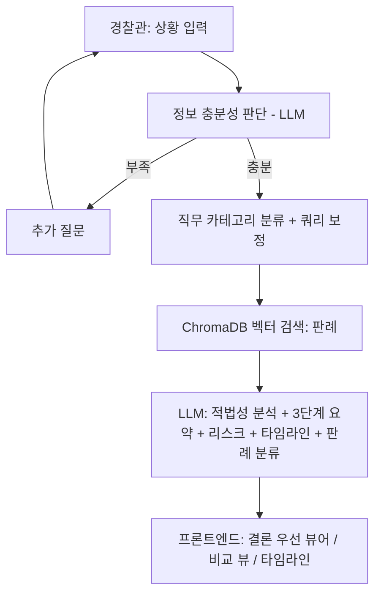

# 경찰관 공무집행 적법성 검증 및 판례 검색 AI 봇

경찰관이 현장 대응·수사 과정에서 취한 조치가 법률 및 판례에 비추어 적법한지
선제적으로 검증하고 지원하는 RAG(Retrieval-Augmented Generation) 기반 챗봇.
자세한 기획 배경은 [`merged_specification.md`](./merged_specification.md) 참고.

## 1. 전체 기획 요약

| 항목 | 내용 |
|---|---|
| 목적 | 현장 조치의 위법 가능성(직권남용, 절차위반 등)을 사전에 점검 |
| 입력 방식 | 자연어 상황 서술 + 대화형 추가 질문(정보 부족 시) |
| 검색 대상 | 경찰 직무 시나리오별로 재분류된 1심 판례 DB + 법령 조문 DB |
| 출력 | 적법성 결론(우선 노출) → 3단계 요약 → 리스크/비교/타임라인 → 원문·보고서 |
| LLM | Google Gemini (`gemini-flash-lite-latest`, 구조화 출력 사용) |
| 임베딩 | `BAAI/bge-m3` (로컬 GPU) — 리랭커 없이 벡터 유사도만으로 정렬 |
| 벡터 DB | ChromaDB (로컬 파일 기반 PersistentClient) |

### 시스템 플로우 (기획서 기준)



## 2. 실제 구현 아키텍처와 데이터 흐름

```
[사용자] --(상황 서술)--> [React 프론트엔드] --fetch--> [FastAPI 백엔드]
                                                            │
                    ┌───────────────────────────────────────┼───────────────────────────────┐
                    ▼                                       ▼                               ▼
            /api/chat (Part 1)                      /api/search (Part 2)            /api/analysis (Part 3)
        judge_chat_sufficiency()                  search_precedents()             analyze_situation()
                    │                                       │                               │
                    ▼                                       ▼                               ▼
            Gemini(구조화 출력)                    term_mapping.py (용어 보정)      search_precedents() 재사용
            ChatResponse 반환                            │                              (판례 top-k 검색)
        (sufficient, follow_up_question,                 ▼                               │
         situation_summary, category)              embedding_service.py                   ▼
                                                    (bge-m3, GPU 임베딩)             Gemini(구조화 출력)
                                                          │                          LLMAnalysisOutput
                                                          ▼                    (verdict, summary, risk_badges,
                                                    chroma_service.py            fact_diffs, timeline,
                                                    (ChromaDB 벡터 검색,          precedent_classifications)
                                                     job_category 필터)                    │
                                                          │                               ▼
                                                          ▼                    AnalysisResponse 조립
                                                    PrecedentHit[] 반환         (적법/위법 사례 분리,
                                                    (유사도 0~100%)              similar_precedents 등)
```

### 데이터 파이프라인 (사전 준비 단계, 1회성)

```
precedent/{경범죄,식품,청소년,공무집행방해,국가배상,직무유기}/1심 판례/*.md
        │  (crawl_precedents.py로 국가법령정보센터 Open API에서 수집,
        │   사건번호 접미사로 1심만 필터링)
        ▼
data_pipeline/parse_precedents.py  →  backend/data_processed/precedents.json

statute/세부법령/*.pdf
        │  (법제처에서 다운로드한 조문 PDF)
        ▼
data_pipeline/parse_statutes.py  →  backend/data_processed/statutes.json

precedents.json + statutes.json
        │
        ▼
data_pipeline/build_index.py  (bge-m3 임베딩 + ChromaDB upsert)
        │
        ▼
ChromaDB (statutes, precedents 컬렉션)
  - precedents는 판례당 "digest"(제목+판시사항+판결요지) 1개 +
    "전문 청크"(chunk_size=1200) 여러 개로 인덱싱됨
  - job_category 메타데이터로 경찰 직무 시나리오별 필터링 가능
```

## 3. 백엔드 모듈별 역할

| 파일 | 역할 |
|---|---|
| `app/main.py` | FastAPI 앱, CORS, 라우터 등록 |
| `app/config.py` | `.env` 기반 설정 (Gemini 키/모델, Chroma 경로 등) |
| `app/taxonomy.py` | 경찰 직무 시나리오 카테고리 정의 (`field_control`, `arrest`, `obstruction_of_duty` 등) 및 법률 영역→카테고리 매핑 |
| `app/term_mapping.py` | 실무 용어 → 법률 용어 보정 딕셔너리 (예: "주취자"→"술에 취한 사람") |
| `app/models/schemas.py` | 전체 API 요청/응답 pydantic 스키마 |
| `app/services/embedding_service.py` | `BAAI/bge-m3` 로컬 GPU 임베딩 (싱글턴 로드) |
| `app/services/chroma_service.py` | ChromaDB PersistentClient, 컬렉션 관리 |
| `app/services/search_service.py` | 질의 보정 → 임베딩 → 벡터 검색 → 판례 단위 중복 제거 → 유사도(%) 변환 |
| `app/services/gemini_service.py` | Gemini 호출 3종: 대화 충분성 판단, 적법성 분석 전체 생성, Fact-Check/설명 |
| `app/routers/chat.py` | `POST /api/chat` |
| `app/routers/search.py` | `POST /api/search` |
| `app/routers/analysis.py` | `POST /api/analysis`, `POST /api/analysis/fact-check` |
| `data_pipeline/` | 판례·법령 파싱 및 ChromaDB 인덱싱 스크립트 |

## 4. 프론트엔드 화면 흐름

3단계 스테퍼 구조 (`src/App.jsx`):

1. **상황 입력** (`SituationInputStep`) — 자연어 서술 + 빠른 상황 선택 칩 → `/api/chat` 호출
2. **핵심 확인** (`ClarifyStep`) — 정보가 부족하면 LLM이 생성한 후속 질문에 답변 반복 → 충분해지면 3단계로
3. **근거·보고서** (`ResultStep`) — `/api/analysis` 호출 결과를 아래 컴포넌트들로 렌더링
   - `ConclusionCard`: 결론 우선 노출 + 상세 근거 접기/펼치기
   - `SummaryGrid`: 판단 기준 / 부족한 사실 / 관련 근거 3열 카드
   - `RiskBadges`: 국가배상·직권남용 등 리스크 배지
   - `ComparisonView`: 적법 사례 vs 위법 사례 Side-by-Side
   - `FactDiffList`: 현재 상황과 판례 간 사실관계 Diff 표
   - `Timeline`: 사건 진행 타임라인 (시점별 1클릭 복사)
   - `SelectionPopover`: 요약문 텍스트 드래그 시 "재검토"/"자세히 설명" → `/api/analysis/fact-check`

## 5. 실행 방법

### 사전 준비
- Python 3.11 (`backend/.venv`), Node.js, CUDA 지원 GPU (bge-m3용, RTX 3070 8GB 기준 검증)
- `backend/.env`에 `GEMINI_API_KEY`, `LAW_OC`(국가법령정보센터 Open API 인증키, 선택) 설정

### 최초 1회: 데이터 인덱싱
```powershell
cd backend
.venv\Scripts\python.exe -m data_pipeline.parse_precedents
.venv\Scripts\python.exe -m data_pipeline.parse_statutes
.venv\Scripts\python.exe -m data_pipeline.build_index --reset
```
> bge-m3 모델(약 4.5GB)을 처음 다운로드하므로 시간이 걸릴 수 있습니다.
> `CHROMA_PERSIST_DIR`은 **한글이 포함되지 않은 경로**로 지정해야 합니다
> (hnswlib이 비-ASCII 경로에서 인덱스 파일을 못 여는 이슈가 있음).

### 백엔드 실행
```powershell
cd backend
.venv\Scripts\python.exe run.py
# http://127.0.0.1:8000 (uvicorn --reload)
```

### 프론트엔드 실행
```powershell
cd frontend
npm install
npm run dev
# http://localhost:5173
```

브라우저에서 `http://localhost:5173` 접속 후 상황을 입력하면 됩니다.

## 6. 판례 데이터 현황

`crawl_precedents.py`(국가법령정보센터 Open API, 1심 판례만 필터링)로 수집:

| 카테고리 | 건수 | 직무 시나리오 매핑 |
|---|---|---|
| 경범죄 | 7 | `field_control` (현장 단속/제지) |
| 식품 | 31 | `admin_sanction` (행정처분/영업단속) |
| 청소년 | 26 | `admin_sanction` |
| 공무집행방해 | 30 | `obstruction_of_duty` |
| 국가배상 | 5 | `liability_risk` |
| 직무유기 | 5 | `liability_risk` |
| **총계** | **104** | |

추가 수집은 `crawl_precedents.py` 실행 후 원하는 법률명/키워드를 입력하면 되며,
1심 여부는 사건번호 접미사(고단/고정/고합/구합 등)로 자동 필터링됩니다.

## 7. 알아두면 좋은 제약사항

- **Gemini 무료 티어 할당량**: 모델별로 일일 호출 한도가 있습니다(`gemini-flash-lite-latest` 기준). 한도 초과 시 500 에러가 나며, 이때 브라우저 콘솔에는 CORS 에러로 잘못 표시될 수 있습니다(FastAPI가 처리되지 않은 예외에서는 CORS 헤더를 붙이지 않기 때문). 실제 원인은 서버 로그에서 확인해야 합니다.
- **리랭커 미사용**: 검색 정렬은 bge-m3 벡터 유사도(코사인 거리 → 0~100% 환산)만 사용합니다. 정확도를 더 높이려면 `BAAI/bge-reranker-large` 등을 추가할 수 있습니다.
- **판례 규모**: 104건은 데모/개발 단계 수준입니다. 실서비스 전에는 시나리오별로 더 많은 1심 판례 확보가 필요합니다.
- **`/api/analysis` 응답 시간**: 검색 + 대규모 구조화 출력 생성을 한 번에 수행하므로 10~20초 정도 걸릴 수 있습니다.
