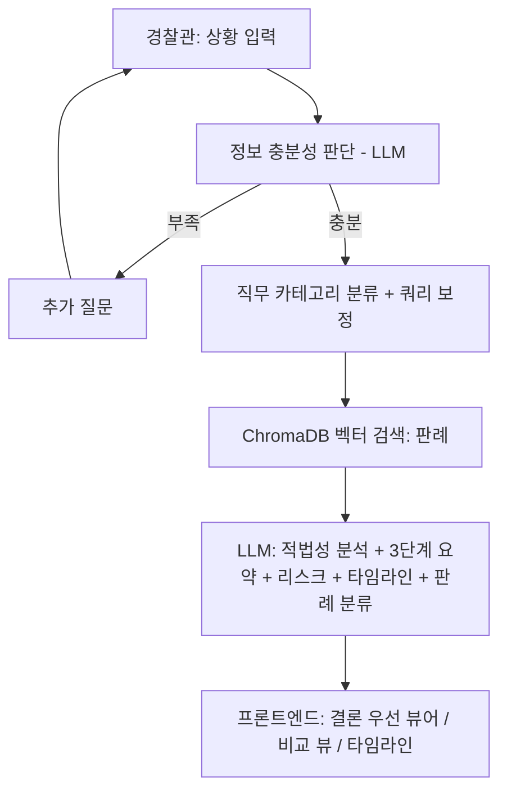

# 경찰관 공무집행 적법성 검증 및 판례 검색 AI 봇

경찰관이 현장 대응·수사 과정에서 취한 조치가 법률 및 판례에 비추어 적법한지
선제적으로 검증하고 지원하는 RAG(Retrieval-Augmented Generation) 기반 챗봇.
자세한 기획 배경은 [`merged_specification.md`](./merged_specification.md) 참고.

## 1. 전체 기획 요약

| 항목 | 내용 |
|---|---|
| 목적 | 현장 조치의 위법 가능성(직권남용, 절차위반 등)을 사전에 점검 |
| 입력 방식 | 자연어 상황 서술(텍스트/음성) + 대화형 추가 질문(정보 부족 시) |
| 검색 대상 | 경찰 직무 시나리오별로 재분류된 1심 판례 DB + 법령 조문 DB |
| 출력 | 적법성 결론(우선 노출) → 3단계 요약 → 리스크/비교/타임라인 → 원문·보고서 |
| LLM | Google Gemini (`gemini-flash-lite-latest`, 구조화 출력 사용) |
| 임베딩 | `BAAI/bge-m3` (로컬 GPU) — 리랭커 없이 벡터 유사도만으로 정렬 |
| 벡터 DB | ChromaDB (로컬 파일 기반 PersistentClient) |

### 시스템 플로우 (기획서 기준)



## 2. 실제 구현 아키텍처와 데이터 흐름

```
[사용자] --(상황 서술)--> [React 프론트엔드] --fetch--> [FastAPI 백엔드]
                                                            │
                    ┌───────────────────────────────────────┼───────────────────────────────┐
                    ▼                                       ▼                               ▼
            /api/chat (Part 1)                      /api/search (Part 2)            /api/analysis (Part 3)
        judge_chat_sufficiency()                  search_precedents()             analyze_situation()
                    │                                       │                               │
                    ▼                                       ▼                               ▼
            Gemini(구조화 출력)                    term_mapping.py (용어 보정)      search_precedents() 재사용
            ChatResponse 반환                            │                              (판례 top-k 검색)
        (sufficient, follow_up_question,                 ▼                               │
         situation_summary, category)              embedding_service.py                   ▼
                                                    (bge-m3, GPU 임베딩)             Gemini(구조화 출력)
                                                          │                          LLMAnalysisOutput
                                                          ▼                    (verdict, summary, risk_badges,
                                                    chroma_service.py            fact_diffs, timeline,
                                                    (ChromaDB 벡터 검색,          precedent_classifications)
                                                     job_category 필터)                    │
                                                          │                               ▼
                                                          ▼                    AnalysisResponse 조립
                                                    PrecedentHit[] 반환         (적법/위법 사례 분리,
                                                    (유사도 0~100%)              similar_precedents 등)
```

### 데이터 파이프라인 (사전 준비 단계, 1회성)

```
precedent/{경범죄,식품,청소년,공무집행방해,국가배상,직무유기}/1심 판례/*.md
        │  (crawl_precedents.py로 국가법령정보센터 Open API에서 수집,
        │   사건번호 접미사로 1심만 필터링)
        ▼
data_pipeline/parse_precedents.py  →  backend/data_processed/precedents.json

statute/세부법령/*.pdf
        │  (법제처에서 다운로드한 조문 PDF)
        ▼
data_pipeline/parse_statutes.py  →  backend/data_processed/statutes.json

precedents.json + statutes.json
        │
        ▼
data_pipeline/build_index.py  (bge-m3 임베딩 + ChromaDB upsert)
        │
        ▼
ChromaDB (statutes, precedents 컬렉션)
  - precedents는 판례당 "digest"(제목+판시사항+판결요지) 1개 +
    "전문 청크"(chunk_size=1200) 여러 개로 인덱싱됨
  - job_category 메타데이터로 경찰 직무 시나리오별 필터링 가능
```

## 3. 백엔드 모듈별 역할

| 파일 | 역할 |
|---|---|
| `app/main.py` | FastAPI 앱, CORS, 라우터 등록 |
| `app/config.py` | `.env` 기반 설정 (Gemini 키/모델, Chroma 경로 등) |
| `app/taxonomy.py` | 경찰 직무 시나리오 카테고리 정의 (`field_control`, `arrest`, `obstruction_of_duty` 등) 및 법률 영역→카테고리 매핑 |
| `app/term_mapping.py` | 실무 용어 → 법률 용어 보정 딕셔너리 (예: "주취자"→"술에 취한 사람") |
| `app/models/schemas.py` | 전체 API 요청/응답 pydantic 스키마 |
| `app/services/embedding_service.py` | `BAAI/bge-m3` 로컬 GPU 임베딩 (싱글턴 로드) |
| `app/services/chroma_service.py` | ChromaDB PersistentClient, 컬렉션 관리 |
| `app/services/search_service.py` | 질의 보정 → 임베딩 → 벡터 검색 → 판례 단위 중복 제거 → 유사도(%) 변환 |
| `app/services/gemini_service.py` | Gemini 호출 3종: 대화 충분성 판단, 적법성 분석 전체 생성, Fact-Check/설명 |
| `app/routers/chat.py` | `POST /api/chat` |
| `app/routers/search.py` | `POST /api/search` |
| `app/routers/analysis.py` | `POST /api/analysis`, `POST /api/analysis/fact-check` |
| `data_pipeline/` | 판례·법령 파싱 및 ChromaDB 인덱싱 스크립트 |

## 4. 프론트엔드 화면 흐름

3단계 스테퍼 구조 (`src/App.jsx`):

1. **상황 입력** (`SituationInputStep`) — 자연어 서술 + 빠른 상황 선택 칩 + 🎤 음성 입력 → `/api/chat` 호출
2. **핵심 확인** (`ClarifyStep`) — 정보가 부족하면 LLM이 생성한 후속 질문에 답변(텍스트/음성) 반복 → 충분해지면 3단계로
3. **근거·보고서** (`ResultStep`) — `/api/analysis` 호출 결과를 아래 컴포넌트들로 렌더링
   - `ConclusionCard`: 결론 우선 노출 + 상세 근거 접기/펼치기
   - `SummaryGrid`: 판단 기준 / 부족한 사실 / 관련 근거 3열 카드
   - `RiskBadges`: 국가배상·직권남용 등 리스크 배지
   - `ComparisonView`: 적법 사례 vs 위법 사례 Side-by-Side (각 판례 카드에 원문 링크 포함)
   - `FactDiffList`: 현재 상황과 판례 간 사실관계 Diff 표
   - `Timeline`: 사건 진행 타임라인 (시점별 1클릭 복사)
   - `SelectionPopover`: 요약문 텍스트 드래그 시 "재검토"/"자세히 설명" → `/api/analysis/fact-check`
   - 하단 액션바: "📖 판례 원문 보기"(유사도 최상위 판례를 새 탭으로 열기), "📄 사건보고서 초안 다운로드 (.md)"(`buildReportMarkdown`으로 전체 분석 결과를 마크다운 파일로 다운로드)

### 음성 입력

`src/hooks/useSpeechRecognition.js`가 브라우저 내장 Web Speech API를 감싸
별도 서버/API 키 없이 음성 인식을 제공합니다. 1단계·2단계의 텍스트 입력창
옆에 있는 🎤 버튼으로 사용할 수 있습니다. Chrome/Edge 등 Chromium 계열
브라우저에서만 지원되며(Firefox 미지원), 지원하지 않는 브라우저에서는
버튼이 자동으로 비활성화됩니다.

## 5. 실행 방법 (git clone 직후 기준)

`backend/.env`, `backend/.venv/`, `backend/chroma_data/`, `backend/data_processed/`,
`frontend/node_modules/`는 모두 `.gitignore`에 포함되어 있어 **클론 직후에는
존재하지 않습니다.** 아래 순서대로 처음부터 준비합니다.

### 사전 준비물
- Python 3.11
- Node.js 18+
- (권장) NVIDIA GPU + CUDA — bge-m3 임베딩 속도용. 없어도 CPU로 동작은 합니다.
- Google Gemini API 키 — https://aistudio.google.com/apikey 에서 무료 발급

### 5-1. 백엔드 환경 구성

```powershell
cd backend
python -m venv .venv
.venv\Scripts\Activate.ps1

# GPU(CUDA)를 쓴다면 torch를 먼저 CUDA 빌드로 설치
pip install torch --index-url https://download.pytorch.org/whl/cu121
# GPU가 없다면 이 줄은 건너뛰어도 됩니다 (requirements.txt 설치 시 CPU용 torch가 함께 설치됨)

pip install -r requirements.txt
```

### 5-2. 환경변수 설정

```powershell
copy .env.example .env
```
`.env` 파일을 열어 최소한 `GEMINI_API_KEY`를 채웁니다. 나머지 값은 기본값으로
대부분 동작하지만, **프로젝트를 클론한 경로에 한글이 포함되어 있다면**
`CHROMA_PERSIST_DIR`을 영문 경로로 바꿔야 합니다(자세한 이유는 `.env.example`
주석 참고). 이 값을 한글 경로로 두면 서버 실행 시 바로 명확한 에러 메시지가
나오도록 되어 있으니(조용히 실패하지 않음), 에러가 뜨면 안내대로 경로만
바꿔주면 됩니다. `LAW_OC`는 판례를 추가 수집할 때만 필요하며 평소 실행에는
필수가 아닙니다.

> ⚠ **`CHROMA_PERSIST_DIR`은 반드시 인덱싱(5-3) 전에 확정하세요.**
> 한글 경로에서 이미 인덱싱을 해버린 폴더를 나중에 영문 경로로
> 옮기기만 해서는 문제가 해결되지 않습니다. 데이터 규모가 크면
> 저장 시점에 이미 벡터 인덱스 파일(`header.bin` 등)이 만들어지지
> 않은 채로 저장되므로, 폴더를 그대로 복사해도 옮긴 위치에서
> 똑같이 `Cannot open header file` 에러가 재현됩니다. 이미 한글
> 경로에서 인덱싱했다면 경로를 바꾼 뒤 `build_index.py --reset`으로
> **처음부터 다시 인덱싱**해야 합니다.

### 5-3. 데이터 준비 및 인덱싱 (최초 1회)

이미 수집된 판례 원문은 `precedent/` 폴더에 포함되어 git으로 함께 배포됩니다.
아래 명령으로 파싱 결과 JSON을 만들고 벡터 인덱스를 구축합니다.

```powershell
# backend 폴더에서 (가상환경 활성화했다면 python, 아니면 .venv\Scripts\python.exe 사용)
.venv\Scripts\python.exe -m data_pipeline.parse_precedents
.venv\Scripts\python.exe -m data_pipeline.parse_statutes
.venv\Scripts\python.exe -m data_pipeline.build_index --reset
```
> `BAAI/bge-m3` 모델(약 4.5GB)을 최초 1회 자동 다운로드하므로 네트워크
> 상황에 따라 수 분~십수 분 걸릴 수 있습니다. 이후 실행부터는 캐시되어
> 빠릅니다.

### 5-4. 백엔드 서버 실행

가상환경이 활성화되어 있지 않으면(프롬프트 앞에 `(.venv)`가 안 보이면)
시스템 Python이 실행되어 `ModuleNotFoundError: No module named 'uvicorn'`
같은 오류가 납니다. 아래 둘 중 하나로 실행하세요.

```powershell
# 방법 A: 가상환경을 활성화한 뒤 실행
.venv\Scripts\Activate.ps1
python .\run.py

# 방법 B: 활성화 없이 .venv의 python을 직접 지정
.venv\Scripts\python.exe .\run.py
```
둘 다 `http://127.0.0.1:8000` 에서 서버가 뜹니다(uvicorn --reload).
`http://127.0.0.1:8000/api/health` 접속해 `{"status": "ok"}`가 나오면 정상입니다.

### 5-5. 프론트엔드 실행 (새 터미널)

```powershell
cd frontend
npm install
npm run dev
# http://localhost:5173
```

브라우저에서 `http://localhost:5173` 접속 후 상황을 입력하면 됩니다.
백엔드 주소를 바꾸고 싶다면 `frontend/.env`에 `VITE_API_BASE_URL=http://주소:포트`를
추가하면 됩니다(기본값은 `http://127.0.0.1:8000`).

### 5-6. 두 번째 실행부터 (재실행 시)

`.venv`, `node_modules`, 인덱스(`chroma_data`)가 이미 만들어져 있다면
5-1~5-3(설치, 인덱싱)은 다시 할 필요가 없습니다. 매번 아래 2단계만
반복하면 됩니다.

```powershell
# 터미널 1: 백엔드
cd backend
.venv\Scripts\Activate.ps1
python .\run.py
# http://127.0.0.1:8000

# 터미널 2: 프론트엔드
cd frontend
npm run dev
# http://localhost:5173
```

다음 경우에만 이전 단계를 다시 실행하면 됩니다.

| 상황 | 다시 해야 할 것 |
|---|---|
| `requirements.txt`가 바뀜 | 5-1의 `pip install -r requirements.txt` |
| `package.json`이 바뀜 | 5-5의 `npm install` |
| `precedent/`, `statute/` 원본 데이터가 바뀌거나 추가됨 | 5-3 전체 (파싱 + `build_index --reset`) |
| `.venv`를 활성화하지 않고 `python run.py`를 실행해 `ModuleNotFoundError: No module named 'uvicorn'`이 뜸 | 5-4의 방법 A 또는 B로 다시 실행 (가상환경 미활성화 문제) |

## 6. 판례 데이터 현황

`crawl_precedents.py`(국가법령정보센터 Open API, 1심 판례만 필터링)로 수집:

| 카테고리 | 건수 | 직무 시나리오 매핑 |
|---|---|---|
| 경범죄 | 7 | `field_control` (현장 단속/제지) |
| 식품 | 31 | `admin_sanction` (행정처분/영업단속) |
| 청소년 | 26 | `admin_sanction` |
| 공무집행방해 | 30 | `obstruction_of_duty` |
| 국가배상 | 5 | `liability_risk` |
| 직무유기 | 5 | `liability_risk` |
| **총계** | **104** | |

추가 수집은 `crawl_precedents.py` 실행 후 원하는 법률명/키워드를 입력하면 되며,
1심 여부는 사건번호 접미사(고단/고정/고합/구합 등)로 자동 필터링됩니다.

각 판례의 원문 링크는 `https://www.law.go.kr/precInfoP.do?precSeq={ID}` 형식의
일반 웹 뷰어 URL을 사용합니다(인증 없이 열림). Open API 상세조회 엔드포인트
(`/DRF/lawService.do`)는 `OC` 인증키가 필요해 브라우저에서 바로 열면
"사용자인증에 실패하였습니다" 오류가 나므로 사용하지 않습니다.

## 7. 알아두면 좋은 제약사항

- **Gemini 무료 티어 할당량**: 모델별로 일일 호출 한도가 있습니다(`gemini-flash-lite-latest` 기준). 한도 초과 시 500 에러가 나며, 이때 브라우저 콘솔에는 CORS 에러로 잘못 표시될 수 있습니다(FastAPI가 처리되지 않은 예외에서는 CORS 헤더를 붙이지 않기 때문). 실제 원인은 서버 로그에서 확인해야 합니다.
- **리랭커 미사용**: 검색 정렬은 bge-m3 벡터 유사도(코사인 거리 → 0~100% 환산)만 사용합니다. 정확도를 더 높이려면 `BAAI/bge-reranker-large` 등을 추가할 수 있습니다.
- **판례 규모**: 104건은 데모/개발 단계 수준입니다. 실서비스 전에는 시나리오별로 더 많은 1심 판례 확보가 필요합니다.
- **`/api/analysis` 응답 시간**: 검색 + 대규모 구조화 출력 생성을 한 번에 수행하므로 10~20초 정도 걸릴 수 있습니다.
- **비ASCII(한글) 경로 문제**: 클론 위치나 `CHROMA_PERSIST_DIR`에 한글이 섞이면 ChromaDB가 쓰는 hnswlib이 벡터 인덱스 파일을 못 여는 문제가 있습니다. 이제는 서버/스크립트 실행 시점에 `RuntimeError`로 즉시 알려주도록 되어 있으므로(`app/services/chroma_service.py`), 에러 메시지에 안내된 대로 `CHROMA_PERSIST_DIR`을 영문 경로로 바꾸면 됩니다.
- **음성 입력 브라우저 호환성**: Web Speech API 기반이라 Chrome/Edge 등 Chromium 계열 브라우저에서만 동작합니다. Firefox 등 미지원 브라우저에서는 🎤 버튼이 자동으로 비활성화됩니다.
