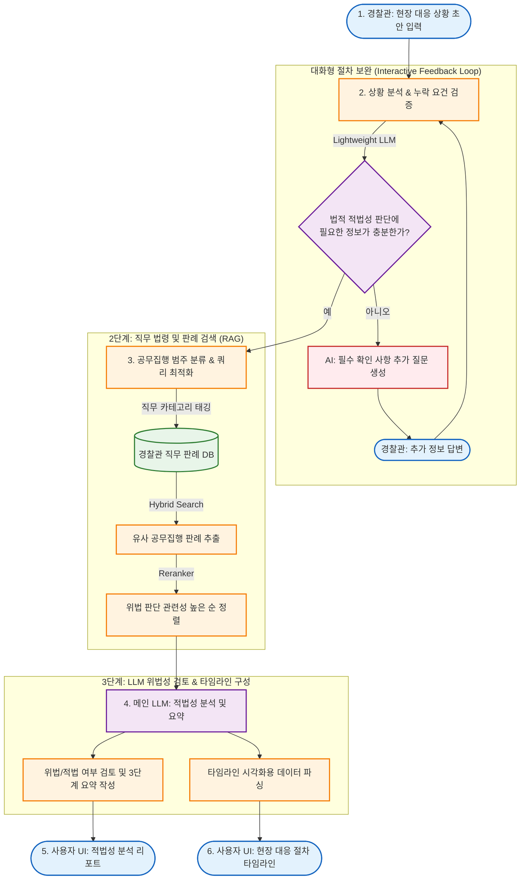

# 📋 [통합 기획서] 경찰관 공무집행 적법성 검증 및 판례 검색 AI 봇

## 1. 프로젝트 개요
* **목적**: 경찰관이 현장 대응 및 수사 과정에서 취한 조치가 법률 및 선례에 비추어 위법(직권남용, 절차위반 등)에 해당하지 않는지 선제적으로 검증하고 지원하는 맞춤형 RAG 기반 검색 봇.
* **주요 특징**: 현장 상황의 자연어 입력, 대화형 피드백을 통한 절차 보완, 경찰 직무 중심의 판례 분류, AI 기반의 3단계 구조화 요약 및 타임라인 시각화 제공.

## 2. 시스템 전체 프로세스 (System Flowchart)

## 3. 상세 기능 요구사항 (Part별 정의)

### Part 1: 자연어 검색 및 NLP 엔진
* **문장형 상황 질의 처리**: "주취자가 난동을 부리는데 체포해도 되나요?" 등 현장 상황 기반의 자연어 질의 분석 및 결론 우선 매칭 알고리즘 구현.
* **실무 언어 ↔ 법률 용어 자동 보정**: 실무자의 상황 위주 표현을 표준 법률 용어("공무집행방해" 등)로 매핑하는 딕셔너리 구축.
* **판례 유사도 정량화 (%)**: 사용자 상황과 판례 간 사실관계 유사도를 정량적 점수로 산출하고 우선순위 정렬에 활용.

### Part 2: 데이터 백엔드 및 연동 엔진
* **직무 시나리오 중심 판례 분류**: 기존 법원 분류 대신 경찰 업무 단계별(현행범체포, 임의동행, 압수수색 등)로 데이터베이스 구조화. 적법/위법 사례 대조 구축.
* **조문 파싱 및 API 연동**: 판례 내 인용 조문 추출 및 국가법령정보센터 Open API를 통한 법령 데이터 동기화.
* **1심 판례 DB 및 심급 상태 추적**: 사실관계가 상세한 1심 판례 중심 인덱싱 및 항소/상고 확정 여부 매칭 추적.

### Part 3: AI 분석 및 요약·시각화 모듈
* **3단계 실무 언어 구조화 요약**:
  1. **3줄 요약**: 현장 즉시 확인용 (결론 + 핵심 기준)
  2. **10줄 요약**: 보고서 작성용 (사실관계 + 판단 근거)
  3. **전문**: 법적 다툼 대비용 판결문 전문
  *(공통 포맷: ① 사건 개요, ② 법원 판단, ③ 현장 참고 핵심 포인트)*
* **리스크 요소 & 사실관계 Diff 분석**: 국가배상, 직권남용 등 책임 리스크 자동 감지. 입력 상황과 유사 판례 간 핵심 사실관계 차이점을 분석하여 경고성 디프(Diff) 추출.
* **Contextual AI 인터랙션**: 요약문 내 텍스트 드래그 시 '재검토(Fact-Check)' 및 '자세히 설명' 로직 인라인 제공.
* **타임라인 자동 재구성**: 순서가 뒤섞인 사실관계를 시간 순서대로 재구성하고 시점별 법적 쟁점을 매칭.

### Part 4: 프론트엔드 및 UI/UX
* **검결 우선 뷰어**: 최상단에 결론 노출, 상세 근거는 하단 접기(Collapsible) 형태로 제공 및 상급심 변동 가능성 고정 안내.
* **시나리오 비교 뷰**: "적법 사례" vs "위법 사례" 병렬(Side-by-Side) 비교 컴포넌트.
* **시각화 배지 UI**: 국가배상/직권남용 리스크 배지, 법령 개정 여부 배지, 유사도(%) 배지, 사실관계 경고 하이라이트 제공.
* **인터랙티브 타임라인 UI**: 시간순 사건 진행 블록 시각화 및 보고서 활용용 텍스트 1클릭 복사/추출 기능 지원.

## 4. 추천 기술 스택
* **Backend & API**: Python, FastAPI / Flask 
* **Vector DB & Search**: Qdrant / Milvus (Metadata Filtering + Hybrid Search)
* **AI Models**: 
  * Embedding: `BAAI/bge-m3` 또는 `text-embedding-3-large`
  * Reranker: `BAAI/bge-reranker-large`
  * LLM: `Gemini 1.5/2.0 Flash` 또는 동급의 LLM (대화형 검증 및 핵심 분석용)
* **Frontend**: React (타임라인 컴포넌트 등)
