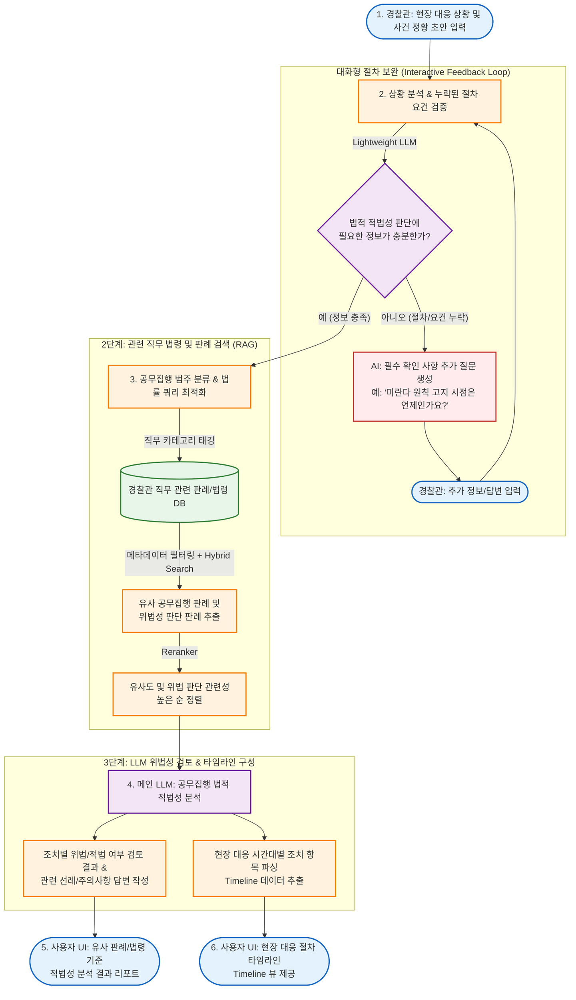

# 📋 [기획서] 경찰관 공무집행 적법성 검증 및 판례 탐색 RAG 시스템

## 1. 프로젝트 개요
* **목적**: 경찰관이 현장 대응 및 수사 과정에서 취한 조치(체포, 검문, 압수수색 등)가 법률 및 선례에 비추어 **위법(직권남용, 절차위반 등)에 해당하지 않는지 선제적으로 검증**하고 지원하는 RAG 기반 검색 봇.
* **주요 기능**:
  1. **사건 정황 입력 및 대화형 대화(Feedback Loop)**: 누락된 절차적 요건을 AI가 대화로 보완.
  2. **직무 범주 분류 및 메타데이터 필터링**: `경찰관직무집행법`, `형사소송법` 등 영역별 인덱싱 및 키워드/의미 기반 검색.
  3. **유사도 기반 판례 추천 (RAG & Reranking)**: 유사한 공무집행 선례 및 위법 판단 판례를 유사도가 높은 순으로 선별해 제공.
  4. **현장 대응 타임라인 시각화**: 조치 시점별 절차 누락 여부를 시간 순서대로 구조화하여 시각화.

---

## 2. 시스템 전체 프로세스 (System Flowchart)

---

## 3. 단계별 세부 상세 기능 명세

### 1단계: 초동 상황 입력 및 대화형 정보 보완 (Interactive Loop)
* **입력**: 경찰관이 현장 정황 및 조치 내용을 자유 형식 텍스트로 입력.
* **검증 규칙**:
  * 소형/고속 LLM이 체포/검문/수색 등 직무 유형에 따른 **필수 법적 절차 요건 체크리스트**와 대조.
  * **누락 요건 감지 예시**:
    * 불심검문 $\rightarrow$ *신분증 제시 여부, 목적 고지 여부*
    * 현행범 체포 $\rightarrow$ *미란다 원칙 고지 시점(체포 전/후/제압 중), 도망/증거인멸 염려 여부*
    * 영장 없는 압수수색 $\rightarrow$ *긴급성 요구조건 충족 여부, 사후영장 청구 계획*
* **수행**: 부족한 정보가 발견되면 AI가 사용자에게 추가 질의를 실행하여 답변을 반영함.

---

### 2단계: 직무 범주 분류 및 Hybrid RAG 검색
* **범주 분류 (Routing)**:
  * 카테고리 메타데이터 생성: `경찰관직무집행법`, `형사소송법`, `체포/구속`, `물리력 행사`, `압수수색` 등.
* **RAG 검색 파이프라인**:
  1. **Metadata Filtering**: 분류된 카테고리 내부 대상만 1차 필터링하여 노이즈 제거.
  2. **Hybrid Search (Dense + Sparse)**:
     * **Dense (Vector)**: `BGE-M3` / `text-embedding-3-large` 활용, 자연어 상황 문맥 유사도 검색.
     * **Sparse (BM25)**: `경직법 제6조`, `형소법 제214조` 등 특정 법률 조문 및 전문 용어 키워드 검색.
  3. **Reranking**:
     * `bge-reranker-large` 등을 적용하여 검색된 판례 상위 10~20개를 **"위법 판단 관련성 점수(Score)"**가 높은 순으로 재정렬.

---

### 3단계: 적법성 평가 리포트 생성 및 타임라인 시각화
* **적법성 검토 리포트 (LLM Response)**:
  * **종합 평가**: 적법 / 주의 요망 / 위법 위험 높음
  * **핵심 리스크 파악**: 절차적 결함 유무(예: *"미란다 원칙 고지 시점이 제압 종료 후 상당 시간이 지나 이루어져 절차상 위법 요소 존재"*).
  * **근거 판례 목록**: 유사도가 높게 나온 선례(`사건번호`, `유사도 점수`, `판시사항`) 명시.
* **타임라인 시각화 (Timeline View Data)**:
  * 입력 및 보완된 데이터에서 시간/순서 정보를 추출하여 JSON 형태로 파싱 후 UI 전달.
  * *예시 구조*:
    * `14:00` - 현장 출동 및 피의자 발견
    * `14:02` - 불심검문 시도 (신분증 제시 완료)
    * `14:05` - 도주 시도에 따른 물리력 행사 및 제압
    * `14:06` - 미란다 원칙 고지 및 현행범 체포

---

## 4. 추천 기술 스택 (Tech Stack)

| 구분 | 추천 스택/도구 | 비고 |
| :--- | :--- | :--- |
| **Data Ingestion** | Python (`requests`, `xml.etree`) | 국가법령정보센터 API 기반 판례 마크다운 크롤러 |
| **Framework** | `LangChain` 또는 `LlamaIndex` | RAG 파이프라인 및 Agent 구축 |
| **Vector DB** | `Qdrant` 또는 `Milvus` | 메타데이터 필터링 및 Hybrid Search 지원 |
| **Embedding** | `BAAI/bge-m3` 또는 `text-embedding-3-large` | 한국어 및 법률 텍스트 인덱싱 성능 최적화 |
| **Reranker** | `BAAI/bge-reranker-large` / `Cohere Rerank` | 유사도 점수 산출 및 최종 재정렬 |
| **LLM (분류/보완)** | `GPT-4o-mini` 또는 `Claude 3.5 Haiku` | 빠른 속도 및 저비용 대화형 루프 처리 |
| **LLM (최종 추론)** | `GPT-4o` 또는 `Claude 3.5 Sonnet` | 복잡한 법적 판단 및 타임라인 파싱 |
| **UI Framework** | `FastAPI` (Backend) + `React` (Frontend) | 타임라인 시각화 컴포넌트(예: React-Vertical-Timeline) 제공 |
